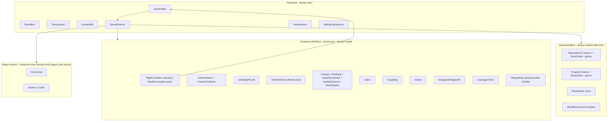
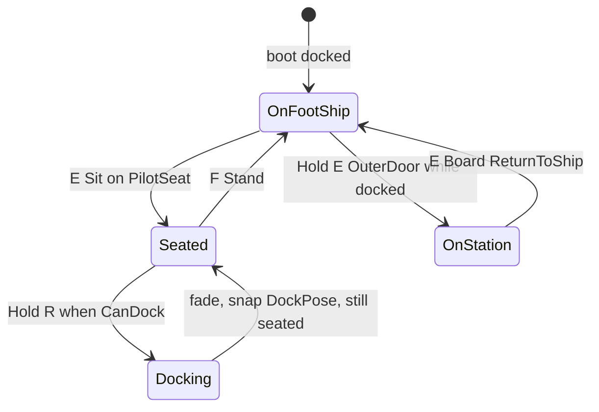
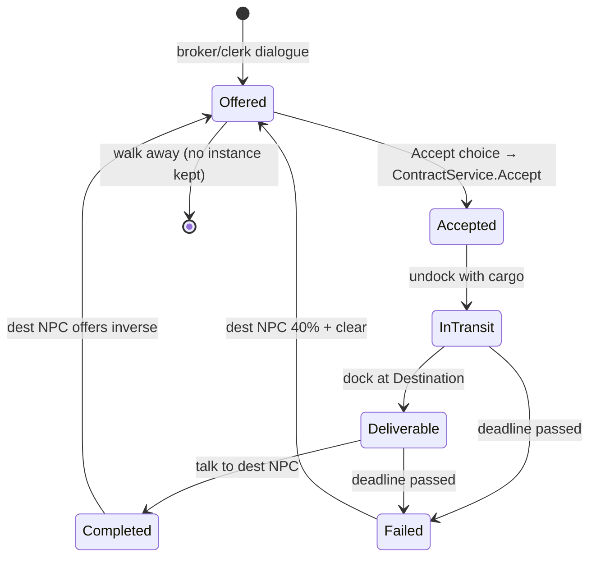
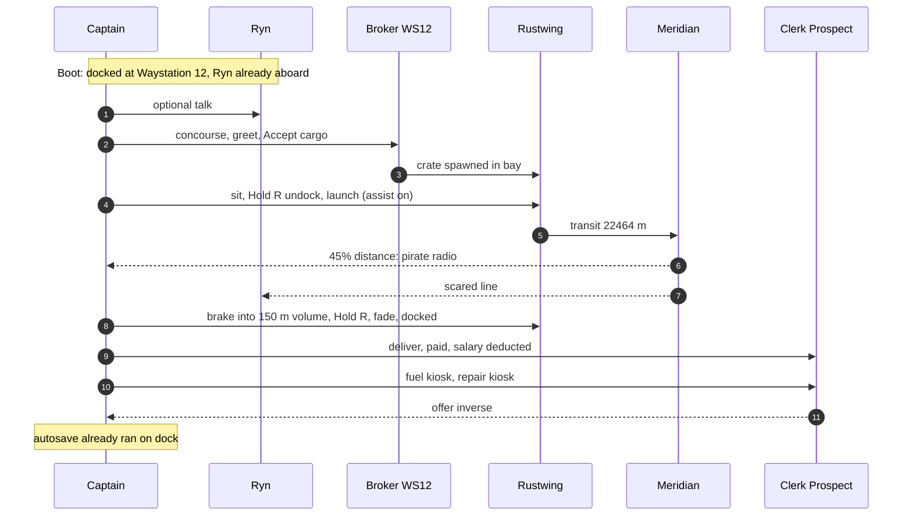
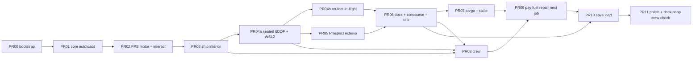

# No Fixed Star — First Playable / MVP Development Plan

| Field | Value |
|---|---|
| **Title** | No Fixed Star First Playable (MVP) — Technical Design |
| **Author** | TBD |
| **Date** | 2026-08-30 |
| **Revised** | 2026-08-30 (review approved, 4 rounds) |
| **Status** | Approved |
| **Engine** | Godot 4.7.x .NET (create with the installed 4.7 editor; pin `Godot.NET.Sdk` to that patch, e.g. 4.7.2) |
| **Language** | C# (simulation) + GDScript (InteractPrompt + tiny UI glue only) |
| **Repo** | `I:\myApps\NoFixedStar` (greenfield; identity doc at `theplan.txt`) |
| **Audience** | Engineers implementing the first playable. This file is the build plan, not a vision deck. |

The north star at `I:\myApps\NoFixedStar\theplan.txt` is identity only. Do not import its feature list, Unreal stack, Event Director, combat, planets, factions, or recruitment loop. If a feature is not required to complete the eight-item loop below, it is out of scope.

---

## Overview

No Fixed Star’s first playable is a single, closed courier loop on PC: walk a greybox StingWasp courier, sit in the cockpit, fly a hybrid-assist 6DOF ship across one small sandbox (Meridian), dock at a second station by scripted volume-and-hold, walk a short concourse, talk to one broker, run one cargo contract with one mid-transit radio scare, keep one engineer alive on a real schedule, get paid, refuel, repair, take the next job, and save/load that state.

The repo is empty of game code. This document specifies the Godot 4.7 .NET project to create, the scene graph, the C# types, the numeric model, the load/unload rules, and the PR sequence. The emotional target is not spectacle. It is: keep a battered courier and one crewmate alive for one more run.

---

## Background & Motivation

`theplan.txt` describes a full space-western life-sim RPG. Building that on day one is how this genre dies. The first playable exists to prove four things that are cheap to name and expensive to get wrong:

1. A walkable ship that is home, not a menu.
2. Flight that has mass, and docking that does not require a precision minigame.
3. A job that starts a story (one authored modifier) without becoming a combat game.
4. A crewmate who lives aboard the ship whether or not the player is watching.

Current state: git repo + `theplan.txt`. No Godot project, no assets, no code. Pain if we skip this document: every system in the north star will try to sneak in during PR 1, and the loop will never close.

---

## Goals & Non-Goals

### Goals (the entire MVP, in this order)

1. Walkable courier interior: cockpit, cabin, cargo bay, airlock.
2. Sit down, launch, hybrid flight with assists on.
3. One other location in the same system (Prospect exterior in the space sandbox).
4. Dock, walk a short concourse, talk to one person.
5. One cargo contract with one modifier (pirate radio warning).
6. One crew member with a real schedule: sleep, eat, work, complain.
7. Get paid, fuel, repair, take the next job.
8. Save/load that whole state.

### Non-goals (explicit)

Ship combat, FPS combat, boarding, weapons. Planetary surfaces, atmospheres, moons, ground exploration. Factions, reputation networks. General Event Director, GOAP, behavior-tree asset libraries, four-layer AI. Multiple crew, NPC↔NPC simulation, romance, mutiny. Third-person, full-body animation. Multiplayer. Mods / Workshop. Photoreal characters. Console / gamepad requirement. Multiple ship classes. Debt collectors. Precision physics docking. Pure-Newtonian flight toggle. Pipe-network power/fluid simulation. Damage-propagation graphs. Generative AI dialogue.

Recruitment is **not** in this MVP. The engineer starts already aboard.

---

## Product Identity (locked, do not expand)

- **Tagline:** Find a crew. Find some work. Keep flying.
- **Player:** a ship captain, not a chosen one.
- **Win:** keep a battered courier and one crewmate alive for one more run.
- **Ship:** StingWasp courier.
- **System:** Meridian. Locations: Waystation 12, Prospect mining outpost.

---

## Proposed Design

### 1. Engine bootstrap

Create the project with the **Godot 4.7.x Project Manager**: New Project → language **C# / .NET**, renderer Forward Plus, path = repo root so `theplan.txt` stays at the root. Do **not** hand-write `project.godot` from scratch. After the editor generates the project, apply the target settings below (PR00 + PR01). Pin `Godot.NET.Sdk` in the generated csproj to the installed editor patch.

Renderer: **Forward Plus**. 3D physics: **Jolt** (`Project Settings → Physics → 3D → Physics Engine` = `Jolt Physics`). Main scene: `res://scenes/main/Boot.tscn`. Root namespace: `NoFixedStar`. Target: `net8.0`. PC, keyboard + mouse. 1080p, 60 fps in ship interior and in the small sandbox. Physics tick: **60 Hz** (Godot default `physics/common/physics_ticks_per_second = 60`). `TimeSystem.Scale` does **not** change physics `dt`; flight length is real-time.

`NoFixedStar.csproj` (generated, then pinned):

```xml
<Project Sdk="Godot.NET.Sdk/4.7.2">
  <PropertyGroup>
    <TargetFramework>net8.0</TargetFramework>
    <EnableDynamicLoading>true</EnableDynamicLoading>
    <Nullable>enable</Nullable>
    <ImplicitUsings>enable</ImplicitUsings>
    <RootNamespace>NoFixedStar</RootNamespace>
    <LangVersion>latest</LangVersion>
  </PropertyGroup>
</Project>
```

Replace `4.7.2` with the installed 4.7.x patch if different. File-scoped namespaces. `partial` on every `Node`/`Resource` type. No GDExtension, no C++.

#### 1.1 `project.godot` — target state after PR01

Autoload entries are added **when their scripts/scenes exist**. PR00 has none. PR01 adds the list below. This block is not the PR00 file.

```ini
[application]
config/name="No Fixed Star"
run/main_scene="res://scenes/main/Boot.tscn"

[display]
window/size/viewport_width=1920
window/size/viewport_height=1080
window/stretch/mode="canvas_items"
window/stretch/aspect="expand"

[rendering]
renderer/rendering_method="forward_plus"

[physics]
3d/physics_engine="Jolt Physics"
common/physics_ticks_per_second=60

[autoload]
EventBus="*res://src/NoFixedStar/Core/EventBus.cs"
TimeSystem="*res://src/NoFixedStar/Core/TimeSystem.cs"
ContentDB="*res://src/NoFixedStar/Core/ContentDB.cs"
GameState="*res://src/NoFixedStar/Core/GameState.cs"
SceneDirector="*res://src/NoFixedStar/Core/SceneDirector.cs"
SaveSystem="*res://src/NoFixedStar/Persistence/SaveSystem.cs"
DebugOverlay="*res://scenes/debug/DebugOverlay.tscn"

[layer_names]
3d_physics/layer_1="world"
3d_physics/layer_2="ship_interior"
3d_physics/layer_3="ship_exterior"
3d_physics/layer_4="player"
3d_physics/layer_5="npc"
3d_physics/layer_6="docking_gizmo"
3d_physics/layer_7="interact"
```

Render layers: default only. No unused `first_person` layer (no arms mesh).

#### 1.2 Collision layer / mask table

| Node | Layer | Mask | Notes |
|---|---|---|---|
| Station static, rocks | 1 world | 0 | StaticBody3D, world-rooted |
| Interior walls/floors (per module) | 2 ship_interior | 0 | StaticBody3D, **parented** to InteriorAnchor. Local-space static is correct because the player is also parented; the parent carries both. CSG `use_collision = false`. One collision source per module. |
| Exterior hull | 3 ship_exterior | 0 | StaticBody3D, parented to ShipRoot. No EVA in MVP; hull exists for debug draws and future, not gameplay overlap. |
| Player capsule | 4 player | **2** when OnShip; **1** when OnStation | Mask swapped on reparent. Never mask 3. |
| Crew capsule | 5 npc | 2 | Always on ship. |
| DockingVolume Area3D | 6 docking_gizmo | 0 | **Gizmo / debug draw only.** `Monitoring = false`. Not source of truth. |
| Interactable Area3D | 7 interact | 0 | `Monitoring = true`, `Monitorable = true`. |
| Player `RayCast3D` | — | 7 | `CollideWithAreas = true`, `CollideWithBodies = false`. |

Jolt Area3D-vs-StaticBody3D overlap is **not used**. Do not enable Jolt static-overlap settings for docking.

#### 1.3 Input map and action sets

Mouse look is **not** an InputMap action. Both modes read `InputEventMouseMotion` in `_UnhandledInput`. No `look` action. **No invert-Y in MVP** (mouse up looks / pitches up).

**MouseMode (locked):**

| Context | `Input.MouseMode` |
|---|---|
| Boot menu showing | `Visible` |
| PauseMenu open | `Visible` |
| `DialoguePlayer.IsOpen` | `Visible` |
| Playing, OnFoot or Seated, no UI | `Captured` |

`GameState.RefreshMouseMode()` is the single writer. `DialoguePlayer.Start` sets `IsOpen = true` then Refresh (releases capture). `Close` sets `IsOpen = false` then Refresh (restores `Captured` **unless** PauseMenu is open). PauseMenu open/close also calls Refresh. Dialogue choices are **click buttons** (keyboard 1–9 optional, not required). Kiosks stay tap-E instant and do not open a cursor UI. F3 overlay does not release capture (F-keys / buttons that do not need a cursor).

**Seated mouse is ship attitude, not cockpit free-look.** `SeatedCamera` stays parented to `PilotSeat` with identity local rotation. Mouse X → yaw (`rotInput.Y`), mouse Y → pitch (`rotInput.X`), Q/E → roll (`rotInput.Z`). All three feed `rotInput`. Deadzone `|rotInput| < 0.05` counts as zero so assist can damp.

**On-foot mouse** yaws `PlayerBody` about local +Y and pitches `WalkCamera` only (clamp ±89°). It does not rotate the ship.

| Action | Binding | Action set |
|---|---|---|
| `move_forward` / `move_back` / `move_left` / `move_right` | W A S D | **Shared keys** — OnFoot walk; SeatedController reads as thrust |
| `jump` | Space | **Shared key** — OnFoot jump; SeatedController reads as thrust-up |
| `sprint` | Shift | **OnFoot** |
| `interact` | E | **OnFoot** (tap = Use; hold = HoldInteractable) |
| `thrust_down` | LCtrl | **Seated** (thrust-up = seated read of `jump` / Space; WASD = seated read of `move_*`) |
| `roll_left` / `roll_right` | Q / E | **Seated** |
| `cut_thrust` | X | **Seated** |
| `stand` | F | **Seated** |
| `dock` | R (hold) | **Seated** — dock **and** undock |
| `pause` | Escape | Always |
| `debug_toggle` | F3 | Always |

`GameState.SetPlayerMode` **switches action sets**. Godot 4 `InputMap` has no action-enable flag. Implement sets as:

1. **WASD and Space are shared physical keys**, bound once (`move_*`, `jump`). `PlayerBody` reads them only when `OnFoot`. `SeatedController` reads the same `move_*` as thrust, and `jump` as thrust-up, only when `Seated`. LCtrl = `thrust_down` (seated-only action).
2. **`SeatedController` is not a child of `PlayerBody`.** It lives on `PilotSeat` (see §4.2). Sit sets `PlayerBody.ProcessMode = Disabled` (descendants stop). A child `SeatedController` with `Inherit` would die. Parent it on the seat; when seated set `ProcessMode = Pausable` (tree-pause still works; it is not under the Disabled body). It stays on the ship when the player reparents to a station.
3. **E is not shared across functions in one mode.** Bound to `interact` (OnFoot) **and** `roll_right` (Seated). Safe because only one controller is live: OnFoot never reads `roll_*`; Seated never reads `interact`. `InteractionRay.Enabled = (mode == OnFoot)`.
4. Seated-only actions: `roll_left` (Q), `roll_right` (E), `stand` (F), `dock` (R), `cut_thrust` (X), `thrust_down` (LCtrl).
5. `pause` / `debug_toggle` always live.

```csharp
void ApplyActionSet(PlayerMode mode)
{
    playerBody.ProcessMode = mode == PlayerMode.OnFoot
        ? ProcessModeEnum.Inherit : ProcessModeEnum.Disabled;
    // SeatedController is on PilotSeat, looked up via SceneDirector.Ship — NOT under PlayerBody.
    var seated = SceneDirector.Instance.Ship!.SeatedController;
    seated.ProcessMode = mode == PlayerMode.Seated
        ? ProcessModeEnum.Pausable   // NOT Inherit (parent is not PlayerBody; Pausable honors tree pause)
        : ProcessModeEnum.Disabled;
    interactionRay.Enabled = mode == PlayerMode.OnFoot;
}
```

**E is never sit, stand, or dock.** On foot E = world interact (PilotSeat tap sits). Seated: Q/E = roll, F = stand, R = hold dock/undock.

### 2. Repository / project layout

```
I:\myApps\NoFixedStar\
├── theplan.txt
├── project.godot
├── NoFixedStar.csproj
├── NoFixedStar.sln
├── .gitignore
├── .editorconfig
├── data\
│   ├── contracts\cargo_standard.tres
│   ├── crew\ryn_calder.tres
│   ├── dialogue\
│   │   ├── broker_waystation12.json
│   │   ├── clerk_prospect.json
│   │   └── crew_ryn.json
│   ├── items\mining_relay_parts.tres
│   ├── locations\
│   │   ├── waystation12.tres
│   │   └── prospect.tres
│   └── flight\rustwing_flight.tres          # FlightStats resource
├── scenes\
│   ├── main\Boot.tscn
│   ├── player\Player.tscn
│   ├── ship\
│   │   ├── Rustwing.tscn
│   │   └── modules\{Cockpit,Cabin,CargoBay,Airlock}.tscn
│   ├── world\
│   │   ├── meridian\SpaceSandbox.tscn
│   │   └── stations\{Waystation12Interior,ProspectInterior}.tscn
│   ├── npc\{Broker,CargoClerk,Engineer}.tscn
│   ├── interact\{PilotSeat,AirlockDoor,RepairKiosk,FuelKiosk}.tscn
│   ├── ui\{Hud,PauseMenu,InteractPrompt,DialogueBox,FadeOverlay}.tscn
│   └── debug\DebugOverlay.tscn
├── assets\
│   ├── audio\{sfx,ui}\
│   ├── materials\
│   ├── meshes\
│   └── sky\starbox.tres
└── src\NoFixedStar\
    ├── Core\        EventBus, TimeSystem, GameState, ContentDB, SceneDirector,
    │                Enums, StartingConditions
    ├── Player\      PlayerBody, SeatedController, InteractionRay
    ├── Ship\        ShipRoot, CargoHold, DockingPort, DockingSystem
    ├── Flight\      FlightController, FlightAssist
    ├── Crew\        CrewAgent, CrewNeeds, UtilityBrain
    ├── Economy\     FuelMarket, RepairService   # constructed on GameState; not autoloads
    ├── Contracts\   Contract, ContractService, IContractModifier, RadioWarningModifier
    ├── World\       SpaceSandbox, StationInterior, DockingVolume
    ├── Interaction\ Interactable, HoldInteractable
    ├── Dialogue\    DialoguePlayer, DialogueGraph, LinePicker
    ├── Persistence\ SaveSystem, SaveData, SaveMigrator, TransformUtil
    ├── UI\          HudPresenter, PauseMenu
    ├── Data\        CrewDef, ItemDef, LocationDef, ContractTemplate, FlightStats
    └── Debug\       DebugOverlay, Cheats
```

C# namespaces match folders. Resource types live under `NoFixedStar.Data` even when `.tres` files live under `data/`.

GDScript is allowed only for `InteractPrompt.gd` (world-space label follow) and throwaway prototypes that must be rewritten in C# before merge if they touch simulation. Simulation is C#. The split exists because a 3D label that tracks a screen projection is noisier in C# and is not simulation.

### 3. Runtime architecture



**Load rules (locked):**

| Scene | When loaded | When unloaded |
|---|---|---|
| Autoloads | Process start | Never |
| `SpaceSandbox.tscn` | New game / load | Never during a session |
| `Rustwing.tscn` | New game / load | Never during a session |
| Station interior | Player exits airlock while docked | Ship **undocks** (keep loaded while docked even if player returns aboard) |
| Planets / streaming | Never | n/a |

Do not stream a planet. Do not duplicate the ship interior per location.

### 4. Scene trees

#### 4.1 Boot

```
Boot (Control) [Boot.cs]          ProcessMode = Always
  ColorRect (full-screen black)
  Label "NO FIXED STAR"
  Buttons: New Game | Continue | Load slot 0/1/2
```

Boot **never quits** and never calls `StartNewGame` until the player picks New Game. Continue is enabled if `user://saves/meta.json` points at a readable slot or autosave. Mouse is `Visible` while `GameState.BootUiOpen` (default true). Boot waits one idle frame for autoloads, then:

- **New Game** → `BootUiOpen = false` → `RefreshMouseMode()` → `GameState.StartNewGame()` → `SceneDirector.LoadSpaceAndShip()`.
- **Continue / Load** → `BootUiOpen = false` → `RefreshMouseMode()` → `SaveSystem.Load(slot)` → `SaveSystem.Apply(data)` (never StartNewGame first). Hide Boot UI (do not queue_free the main scene).

`SceneDirector.LoadSpaceAndShip` instances space + ship, snaps the Rustwing to Waystation 12 `DockPose`, parents the player to `InteriorAnchor` at `PlayerSpawnCabin`, sets `DockedLocation = Waystation12`, `PlayerMode = OnFoot`, `PlayerPresence = OnShip`. Game begins docked, on foot, engineer already in the cabin.

#### 4.2 Rustwing (`scenes/ship/Rustwing.tscn`) — locked world pose

**`Rustwing` (`ShipRoot`) IS the world pose.** `FlightController.Integrate` mutates velocities only; `ShipRoot._PhysicsProcess` applies `GlobalPosition += v*dt` every physics tick when not docked. `FlightBody` and `InteriorAnchor` stay **identity-local** children (`Transform3D.Identity`). They do not move relative to `ShipRoot`. `SeatedCamera` is a child of `PilotSeat` (no free-look). Canopy is **opaque CSG** — no glass, no viewport windows.

Greybox: CSG or blockout meshes. Used-industrial art direction is **not** a gate. CSG `use_collision = false` on every module.

Approximate local layout, +Z **forward**, +Y **up**, 1 unit = 1 meter. Floor at local Y = 0. Doorway apertures **1.2 m wide × 2.1 m high** (capsule diameter 0.8 m). Rooms are 4 m wide; the 1.2 m figure is the **door**, not the hall.

Module stack along Z (origins = module geometric centers):

```
        +Z forward
Cockpit   x[-2, +2]  y[0, 2.4]  z[11.5, 14.5]   length 3.0
Cabin     x[-2, +2]  y[0, 2.4]  z[ 6.5, 11.5]   length 5.0
CargoBay  x[-2, +2]  y[0, 2.6]  z[ 0.5,  6.5]   length 6.0
Airlock   x[-1.25,+1.25] y[0, 2.4] z[-2.0, 0.5] length 2.5
        -Z aft (docking port)
```

Doorways centered on X=0 at bulkheads z = 11.5, 6.5, 0.5.

```
Rustwing (Node3D) [ShipRoot.cs]                 # WORLD POSE — _PhysicsProcess applies v*dt
  FlightController (Node) [FlightController.cs] # Integrate() mutates velocities + fuel only
  FlightBody (Node3D)                           # Transform = Identity. Mesh grouping only.
    ExteriorMesh                                # blockout hull
    ExteriorCollision (StaticBody3D, layer 3)   # parented local-static
    DockingPort (Marker3D)                      # local pos (0, 1.2, -2.0); Basis -Z = outward aft
  InteriorAnchor (Node3D)                       # Transform = Identity. Walk / crew live here.
    Modules
      Cockpit.tscn
        Collision (StaticBody3D, layer 2)
        PilotSeat (Interactable, tap → sit)
          SeatedCamera (Camera3D)               # current only when Seated; local identity
          SeatedController (Node) [SeatedController.cs]
            # NOT under PlayerBody. ProcessMode Pausable when seated, Disabled when OnFoot.
            # Stays on the ship if the player reparents to a station.
        StandSpawn (Marker3D)                   # local ~ (0.7, 0, 13.2) starboard of seat, on floor
        Canopy (CSG, opaque, use_collision=false)
      Cabin.tscn
        Collision (StaticBody3D, layer 2)
        PlayerBunk
        CrewBunk (Marker3D CrewSleep)
        Hotplate (Marker3D CrewEat)
        Locker
      CargoBay.tscn
        Collision (StaticBody3D, layer 2)
        CargoSnap (Marker3D)
        Workbench (Marker3D CrewWork)
      Airlock.tscn
        Collision (StaticBody3D, layer 2)
        InnerDoor                               # ALWAYS OPEN in MVP. No Interactable. Visual frame only.
        OuterDoor (HoldInteractable 0.5 s)      # usable iff Docked && Presence==OnShip
        PlayerExitSpawn (Marker3D)              # at outer threshold, facing -Z (out)
        PlayerEnterSpawn (Marker3D)             # inside airlock, facing +Z (into cargo)
    NavigationRegion3D                          # baked on interior floor, local to InteriorAnchor
    InteriorLights
    PlayerSpawnCabin (Marker3D)                 # cabin floor, ~ (0, 0, 9.0)
    CrewSpawn (Marker3D)
    CargoHold (Node) [CargoHold.cs]             # VIEW: instances crate at CargoSnap from GameState cargo id
    Crew (Engineer.tscn)                        # parented here always
    Player (Player.tscn)                        # parented here when OnShip; reparented to station when OnStation
```

There is no `ShipSystems` node. `ShipSystems` is a POCO on `GameState` only. `CargoHold` is a view.

**InteriorAttitudeHold** applies only while the player is on foot aboard **and** the ship is not yet parked (the ~2 s damp after standing). Full 6DOF only while seated.

**R1 fallback (pre-authorized, do not implement unless the PR04b tripwire fires):** origin-locked interior.

Tripwire: if, after two working days on PR04b, parented `PlayerBody.MoveAndSlide` still double-counts ship motion or floors fail, switch to this tree. Do not implement both at once.

Fallback tree:

```
World
  SpaceSandbox
    RustwingDummy (Node3D)          # fallback world pose; same Integrate + apply-once as ShipRoot
      ExteriorMesh + ExteriorCollision
      DockingPort
      DummyPilotSeat
        SeatedCamera                # current when Seated
        SeatedController            # same: never under PlayerBody
  InteriorWorld (Node3D at (0, -10000, 0) — far offset, never overlaps space)
    InteriorAnchor (static, Y-up)
      …same modules, navmesh, crew, player…
      PilotSeat                     # sit = fade 0.4 s, switch CurrentCamera to DummyPilotSeat.SeatedCamera
      StandSpawn                    # stand = fade, CurrentCamera = WalkCamera, player at StandSpawn
```

Dock snap moves **only** `RustwingDummy`. Canopy stays opaque so windows are not required. Crew never leaves InteriorWorld. Same `GameState` fields.

#### 4.3 Space sandbox (`scenes/world/meridian/SpaceSandbox.tscn`)

```
SpaceSandbox (Node3D)
  WorldEnvironment                  # black sky + starbox, no SDFGI
  DirectionalLight3D                # dim
  Locations
    Waystation12Exterior (Node3D)
      StationMesh                   # CSG ring / box cluster ~80 m, use_collision=false
      Collision (StaticBody3D, layer 1)
      DockCollar (Marker3D)         # world position of the collar face
      DockPose (Marker3D)           # ship snap: DockingPort 8 m from collar, ship +Z away from station
      DockingVolume (Area3D, layer 6) [DockingVolume.cs]   # gizmo only, Monitoring=false
        CollisionShape3D Sphere radius = 150 m
    ProspectExterior (Node3D)
      StationMesh                   # ~50 m
      Collision (StaticBody3D, layer 1)
      DockCollar
      DockPose
      DockingVolume                 # same 150 m gizmo
  Debris
    Rock_01..Rock_08                # CSGSphere, StaticBody3D layer 1, unlit
```

World coordinates in meters. Waystation 12 at origin. Prospect at `(22000, 600, 4500)` ⇒ Euclidean **22464 m**. At 120 m/s cruise = **187 s** (~3.1 min) plus rotate/brake. That is the intended first-flight length.

| Location | Position (m) | Notes |
|---|---|---|
| Waystation 12 exterior | `(0, 0, 0)` | Start. |
| Prospect exterior | `(22000, 600, 4500)` | Distance 22464 m. |
| Rustwing docked at WS12 | `DockPose` of WS12 | Game begins here. |

No planets, no atmospheres, no moon landings.

`DockPose` construction (both stations): collar has an outward axis `CollarOut` (away from the station hull). Ship snap:

```
ShipRoot.GlobalPosition such that DockingPort.GlobalPosition = DockCollar.GlobalPosition + CollarOut * 8
ShipRoot.Basis: +Z = CollarOut (ship forward points away from station), +Y = world up (or collar up if defined)
```

Undock then moves along ship +Z, away from the collar.

#### 4.4 Waystation 12 concourse (`scenes/world/stations/Waystation12Interior.tscn`)

```
Waystation12Interior (Node3D) [StationInterior.cs]
  Concourse (CSG ~18 m hallway, 4 m wide, 3.2 m high, use_collision=false)
    Collision (StaticBody3D, layer 1)
    Lights
  StationAirlock (Marker3D)         # spawn facing +concourse when exiting ship
  ReturnToShip (Interactable, tap)  # hatch back to ship; PlayerEnterSpawn on the ship side
  BrokerDesk
    Broker (NPC)                    # Marek Quinn — the item-4 "one person"
  FuelKiosk (Interactable, tap)
  RepairKiosk (Interactable, tap)
```

No station navmesh. Broker is a capsule + nameplate. Fuel/repair are **kiosks only**, not dialogue options.

#### 4.5 Prospect interior (`scenes/world/stations/ProspectInterior.tscn`)

Same pattern, ~10 m hallway. Cargo clerk **Joss Veld** instead of broker. Fuel + repair kiosks. Clerk completes delivery and offers the inverse contract. Talking to the **broker at Waystation 12** is the item-4 requirement.

`SceneDirector.EnsureStationInterior(id)` loads `ContentDB.GetLocation(id).Interior`.

### 5. Player, camera, interaction

**On foot:** `PlayerBody : CharacterBody3D`. Capsule radius **0.4 m**, height **1.8 m**. `WalkCamera` (`Camera3D`) at 1.65 m. First-person only. No body mesh. On-foot mouse (Captured): yaw unconstrained on the **body** (`RotateObjectLocal(Vector3.Up, -relative.X * MouseSensitivity)`), pitch on `WalkCamera` only (`RotateX(-relative.Y * MouseSensitivity)`, clamp ±89°, no invert: mouse up looks up). Sensitivity: `StartingConditions.MouseSensitivity` = **0.0025 rad/pixel**.

| Motor constant | Value |
|---|---|
| `WalkSpeed` | 3.5 m/s |
| `SprintMultiplier` | 1.6 → 5.6 m/s |
| `StepHeight` / `MaxStepHeight` | 0.35 m |
| `JumpVelocity` | 4.0 m/s (OnStation and OnShip) |
| `FloorSnapLength` | 0.25 m |
| `MotionMode` | `Grounded` |
| `MaxFloorAngle` | 45° |

**`PlayerBody` runs `_PhysicsProcess`.** There is no separate `PlayerMotor` node. `InteractionRay` is a `RayCast3D` child of `WalkCamera`. **`SeatedController` is a child of `PilotSeat`, not of `PlayerBody`.** `Player.tscn` contains only the capsule, `WalkCamera`, and `InteractionRay`.

**Interaction:** `RayCast3D` length 2.4 m, mask = layer 7, **`CollideWithAreas = true`**, `CollideWithBodies = false`. On hover: world prompt. On foot only: tap E = `Use()`, hold E for `HoldInteractable` (OuterDoor). Seated: ray disabled; dock is the `dock` action, not a ray.

Prompt copy:

| Context | Prompt |
|---|---|
| PilotSeat | `E  Sit` |
| Broker / clerk / Ryn | `E  Talk` |
| OuterDoor (docked) | `Hold E  Exit` |
| ReturnToShip | `E  Board` |
| FuelKiosk | `E  Buy fuel` |
| RepairKiosk | `E  Repair` |
| Seated, can dock | `Hold R  Dock` |
| Seated, in volume but too fast | `Slow down to dock` |
| Seated, docked | `Hold R  Undock` |
| Seated, otherwise | `F  Stand` (always available as HUD hint, not world prompt) |

**Sit:** PilotSeat `Use` → `GameState.SetPlayerMode(Seated)` (`ApplyActionSet`: `PlayerBody.ProcessMode = Disabled`, `SeatedController.ProcessMode = Pausable`, ray off). `PlayerBody` stays Disabled while seated. `WalkCamera.Current = false`; `SeatedCamera.Current = true`. `SeatedCamera` and `SeatedController` remain children of `PilotSeat`. **No free-look cockpit.** `SeatedController` maps mouse onto ship `rotInput` (see §1.3 / §6). Player stays parented to `InteriorAnchor`; capsule is ignored while seated.

**Stand (F while seated):**

1. `GameState.SetPlayerMode(OnFoot)` — swaps action sets, cuts seated thrust input to **0**.
2. Teleport `PlayerBody.GlobalTransform = StandSpawn.GlobalTransform`. `Velocity = Zero`. `ResetPhysicsInterpolation()`.
3. `WalkCamera.Current = true`; `SeatedCamera.Current = false`; re-enable `PlayerBody` physics.
4. **Standing while flying parks the ship:** `FlightController` sees OnFoot + undocked → ignore thrust, assist damps **linear and angular** velocity to zero (~2 s at 1.8/s). This is the implementable MVP. There is no cruise-hold-while-walking.

PR04a: stand is **refused unless docked** (`SetPlayerMode(OnFoot)` no-op in flight). PR04b: stand allowed in flight and parks.

**Player parenting:** `PlayerBody` is a child of `InteriorAnchor` when `OnShip`, child of the station root when `OnStation`. Parenting carries ship motion. `MoveAndSlide` velocity is **walk-relative only** — do not add `ShipRoot` linear/angular velocity.

Wish direction is built from **body/camera yaw on the floor plane**, not from `InteriorAnchor.Basis` or `Basis.Identity`. W walks where the player is looking. Keep parented relative `MoveAndSlide` — **do not add ship velocity**.

#### 5.1 PlayerBody algorithm (OnShip)

```
UpDirection = InteriorAnchor.GlobalTransform.Basis.Y

read move_* (action set already OnFoot)
// PlayerBody is parented; mouse has already yawed this node about local +Y.
wishLocal = Transform.Basis * Vector3(right, 0, -forward)   # body-yaw frame, ship-local
wishLocal.Y = 0
if wishLocal.Length() > 1e-4: wishLocal = wishLocal.Normalized()
speed = sprint ? WalkSpeed * SprintMultiplier : WalkSpeed
_relLocal.X = wishLocal.X * speed
_relLocal.Z = wishLocal.Z * speed
_relLocal.Y -= 9.8 * physicsDt                    # ship-local gravity (body is yaw-only, local Y == ship Y)
if IsOnFloor() && _relLocal.Y < 0: _relLocal.Y = 0
if jump pressed && IsOnFloor(): _relLocal.Y = JumpVelocity

parentBasis = InteriorAnchor.GlobalTransform.Basis
Velocity = parentBasis * _relLocal                # world-space RELATIVE walk
                                               # parent already applied ship motion — do not add it
MoveAndSlide()
_relLocal = parentBasis.Inverse() * Velocity      # keep vertical for next tick
```

`FloorSnapLength` and `MaxStepHeight` as in the table. Collision mask = layer 2.

#### 5.2 PlayerBody algorithm (OnStation)

```
UpDirection = Vector3.Up
wish = Transform.Basis * Vector3(right, 0, -forward)   # body yaw, world
wish.Y = 0
if wish.Length() > 1e-4: wish = wish.Normalized()
speed = sprint ? WalkSpeed * SprintMultiplier : WalkSpeed
Velocity.X = wish.X * speed
Velocity.Z = wish.Z * speed
Velocity.Y -= 9.8 * physicsDt
if IsOnFloor() && Velocity.Y < 0: Velocity.Y = 0
if jump pressed && IsOnFloor(): Velocity.Y = JumpVelocity
MoveAndSlide()
```

Collision mask = layer 1. Same “do not add ship velocity” (there is no ship parent).

#### 5.3 Reparent (airlock)

Only `Player.tscn` is reparented. Crew never leaves the ship.

```
var xform = player.GlobalTransform
player.GetParent().RemoveChild(player)
newParent.AddChild(player)
player.GlobalTransform = xform
player.Velocity = Vector3.Zero
player.ResetPhysicsInterpolation()
player.CollisionMask = newMask          # 2 on ship, 1 on station
player.UpDirection = newUp
GameState.SetPresence(...)
```

#### 5.4 Airlock / station transition

**InnerDoor:** always open. Visual frame. No behavior, does not block crew.

**OuterDoor** (`HoldInteractable`, 0.5 s), only if `DockedLocation != None && Presence == OnShip`:

1. Fade 0.4 s (always 0.4 s; one duration for dock, airlock, sit-fallback).
2. `SceneDirector.EnsureStationInterior(DockedLocation)` — `ContentDB.GetLocation(id).Interior`.
3. Reparent player to station root; teleport to `StationAirlock`; facing concourse.
4. `WalkCamera.Current = true`. `ProcessMode` inherit.
5. Fade in.

**ReturnToShip** (tap): fade 0.4 s, reparent to `InteriorAnchor`, teleport `PlayerEnterSpawn` (facing +Z into cargo), fade in. Station stays loaded until undock.

**Undock guard:** `SceneDirector.RequestUndock` / `GameState.SetUndocked` **returns false** unless `Presence == OnShip && Mode == Seated && PowerOn`. This prevents unloading a station while the player node is inside it.



### 6. Flight model

`FlightController` is a child of `ShipRoot`. Custom integrator (not `RigidBody3D`). **`Integrate` mutates velocities (and fuel) only.** `ShipRoot._PhysicsProcess` applies position **once**, before children run:

```
ShipRoot._PhysicsProcess(dt):
    Flight.Integrate(dt)                         # LinearVelocity / AngularVelocity / fuel only
    if DockedLocation == None:
        GlobalPosition += Flight.LinearVelocity * dt
        GlobalBasis = RotatedByAngular(GlobalBasis, Flight.AngularVelocity, dt)
    # ContractService.PhysicsTick is GameState._PhysicsProcess — do not call it here
```

State on `FlightController`: `LinearVelocity` (world m/s), `AngularVelocity` (world rad/s). Mass from `GameState.Ship.MassKg`.

`rotInput` is ship-local `(pitchX, yawY, rollZ)`, components in **[-1, 1]**. Built by `SeatedController`:

```
// _UnhandledInput: accumulate, no invert-Y
_mouseYaw   += event.Relative.X * MouseSensitivity      // rad
_mousePitch += -event.Relative.Y * MouseSensitivity     // mouse up (neg Y) → +pitch

// physics frame, then zero accumulators
rotInput.Y = Clamp(_mouseYaw   / dt / MaxAngSpeed, -1, 1)  // yaw  about ship +Y
rotInput.X = Clamp(_mousePitch / dt / MaxAngSpeed, -1, 1)  // pitch about ship +X
rotInput.Z = Input.GetAxis("roll_left", "roll_right")      // Q/E
if rotInput.Length() < 0.05: rotInput = 0                  // deadzone → assist damps
_mouseYaw = 0; _mousePitch = 0

thrustInput = (move_right-move_left, jump-thrust_down, move_forward-move_back)
if cut_thrust: thrustInput = 0
```

Torque / inertia are on `FlightStats` so `MaxAngSpeed` 1.1 rad/s is reached in **~0.5 s**: `TorqueNm / Inertia = 2.2 rad/s²` (`TorqueNm = 110_000`, `Inertia = 50_000`).

Each physics frame when **not docked**:

```
thrustInput, rotInput from SeatedController if Seated && PowerOn && Fuel > 0
else thrustInput = 0, rotInput = 0     # OnFoot parks; assist damps

a = (Stats.ThrustN * thrustInput) / MassKg     # thrustInput in ship space, then ToWorld
LinearVelocity += a * dt
angAccelLocal = (Stats.TorqueNm * rotInput) / Stats.Inertia
AngularVelocity += (ShipRoot.GlobalBasis * angAccelLocal) * dt

if AssistEnabled:                              # ON by default; debug-only off
    if thrustInput ≈ 0: LinearVelocity  = ExpDamp(LinearVelocity, LinearDamp, dt)
    if rotInput ≈ 0:    AngularVelocity = ExpDamp(AngularVelocity, AngularDamp, dt)
    if PlayerMode == OnFoot:                   # InteriorAttitudeHold + park
        AngularVelocity = ExpDamp(AngularVelocity, AngularDamp, dt)

LinearVelocity = LinearVelocity.LimitLength(MaxSpeed)
AngularVelocity = ClampLength(AngularVelocity, MaxAngSpeed)
# DO NOT write ShipRoot transform here

GameState.Ship.ConsumeFuel(commandedThrustN, realDt)
```

`ExpDamp(v, k, dt) = v * exp(-k * dt)`. At k = 1.8/s, 120 m/s → ~3 m/s in 2 s. Stopping distance `v/k = 67 m`.

**Fuel burns commanded thrust**, even when the speed limiter is clipping. Holding W at 120 m/s burns max rate. That is the intended pressure.

Docked ⇒ do not integrate; velocities hard-zero; transform stays at `DockPose` until undock.

**No Newtonian toggle in the pause menu.** `AssistEnabled` may exist on F3.

#### Docking (scripted distance + hold + fade, not Area3D, not precision physics)

Source of truth: `DockingSystem` (child of `ShipRoot` or `SceneDirector`) each **physics frame** tests `ShipRoot` / `DockingPort` against every `LocationDef` collar. `DockingVolume` Area3D is a 150 m sphere gizmo (`Monitoring = false`).

```
CanDock iff ALL:
  PlayerMode == Seated
  DockedLocation == None
  PowerOn
  distance(DockingPort.GlobalPosition, Collar.GlobalPosition) <= ApproachRadius (150 m)
  LinearVelocity.Length() <= DockSpeedGate (15 m/s)
  alignment: portOut.Dot(toCollar) >= cos(45°)
      portOut = -ShipRoot.GlobalTransform.Basis.Z     # aft outward
      toCollar = (Collar.GlobalPosition - DockingPort.GlobalPosition).Normalized()
```

Hold `dock` (R) 0.5 s while `CanDock` stays true. Leaving the volume, speeding up, or releasing R aborts. If in radius but too fast: prompt `Slow down to dock`, hold ignored.

```mermaid
sequenceDiagram
  participant P as SeatedController
  participant DS as DockingSystem
  participant SD as SceneDirector
  participant FC as FlightController
  participant GS as GameState

  loop every physics tick
    DS->>DS: distance + alignment + speed vs collars
  end
  DS->>P: CanDock → prompt Hold R Dock
  P->>DS: hold R 0.5s
  DS->>SD: RequestDock(locationId)
  SD->>P: fade 0.4s
  SD->>FC: ZeroVelocities()
  SD->>FC: ShipRoot.GlobalTransform = DockPose
  SD->>GS: DockedLocation = locationId
  SD->>SS: Autosave (hook; stub until PR10)
  SD->>P: fade in; still seated
```

**Coupled docking numbers** (one set; cruise-then-brake works):

| Constant | Value | Role |
|---|---|---|
| `MaxSpeed` | 120 m/s | Limiter. |
| `LinearDamp` | 1.8 / s | Exp damp. Stopping distance 120/1.8 ≈ **67 m**. Time 120 → 15 m/s ≈ 1.16 s, ~58 m. |
| `ApproachRadius` | **150 m** | > stopping distance. Enter at cruise, release throttle, still inside when speed-gated. |
| `DockSpeedGate` | **15 m/s** | Snap / hold only below this. |
| `DockHoldSeconds` | **0.50 s** | Short enough to complete after brake, long enough to be deliberate. |
| `AlignmentHalfAngle` | 45° | Aft port vs collar. |
| `DockStandoff` | 8 m | Snap pose, not the detection volume. |
| `UndockImpulse` | **+4 m/s along ship +Z** | Forward, **away from collar**. Never aft. |

Skip Dock (F8) is a cheat, not the intended path.

**Undock:** seated, docked, hold R 0.5 s. Guard as in §5.4. Sequence: `UnloadStationInterior` if present, `DockedLocation = None`, `LinearVelocity = ShipRoot.GlobalTransform.Basis.Z * 4`, enable flight.

### 7. Systems fidelity (not pipe physics)

`ShipSystems` is a POCO on `GameState`. No ship-tree node.

| System | MVP representation |
|---|---|
| Fuel | `0..1`. `ConsumeFuel(commandedThrustN, realDt)`. 0 fuel ⇒ thrust ignored (assist still damps). |
| Power | `PowerOn` bool + `PowerAvailable` 0..1 (no drain in MVP; field exists for save stability). Power off ⇒ cannot undock / no thrust. |
| Hull | `0..1`, start 0.58. Not damaged by flight. Repair kiosk restores. |
| Engine | `0..1`, start 0.62. Repair kiosk restores. No in-flight failure. |
| Cargo | occupancy from `ItemDef`; crate mesh from `ItemDef.PickupMesh` instanced by `CargoHold` view. `MassKg = 42000 + cargo kg`. |

No damage-propagation graph. No oxygen, cooling, FTL, weapons, shields.

### 8. Time, fuel, deadlines (concrete numbers)

`TimeSystem` is the only clock. Autoload. Integer **game minutes** since epoch. Display `Day {n}  HH:MM` (24h). Default scale: **30 game seconds per 1 real second** (30×). **Scale does not change physics `dt`.** Flight, damping, and fuel burn use physics/real dt.

**Pause (locked):** `GetTree().Paused = true` **and** `TimeSystem.Paused = true`. Flight, player, crew inherit pause and stop. These nodes are `PROCESS_MODE_ALWAYS`: `PauseMenu`, `DebugOverlay`, `DialogueBox`, `FadeOverlay`, `Boot`. Debug cheats work while paused. Pause and dialogue set `Input.MouseMode = Visible` via `GameState.RefreshMouseMode()` (§1.3). PauseMenu sets `GameState.PauseUiOpen`; `DialoguePlayer.Close` consults it.

All numeric gameplay constants live in `StartingConditions.cs`. Tune there, not by rewriting systems.

| Constant | Value | Why |
|---|---|---|
| `TimeScale` | 30 | 30 min playtest ≈ 15 game hours; crew will eat. |
| `EpochTotalMinutes` | **460** | Day 1 07:40. `Day = TotalMinutes / 1440 + 1`. |
| First deadline | Epoch + 6×60 = 820 (Day 1 13:40) | 12 real minutes. Flight 187 s + brake/dock/walk ~3 min ⇒ slack. |
| Fuel start | 0.37 | |
| `FuelBurnPerRealSecondAtMaxThrust` | 0.00055 | Commanded thrust. Full-throttle one-way 187 s × 0.00055 = **0.103**. Two one-way jobs: remaining **0.164** (on the 0.15 low-fuel line). A third hop is possible (~0.06). |
| `MaxSpeed` | 120 m/s | 22464 m in 187 s. |
| Mass empty | 42 000 kg | + cargo kg from ItemDef. |
| Main / strafe / vert thrust | 120 / 40 / 25 kN | ~2.9 m/s² empty. |
| Linear / angular damp | 1.8 / 2.4 per s | |
| Max ang speed | 1.1 rad/s | Reachable in ~0.5 s. |
| `TorqueNm` / `Inertia` | 110 000 N·m / 50 000 kg·m² | `α = T/I = 2.2 rad/s²`. |
| Credits start | 1 200 | |
| Debt | 18 500 **display only** | No collectors. |
| Hull / engine start | 0.58 / 0.62 | |
| Contract pay | 850 | |
| Engineer salary | 120, deducted on payout | |
| Fuel price | 4 credits per 1% | 37% → 80% = 172 cr. |
| Repair | 5 credits per 0.01 tick; see §11 | Full hull 0.58→1.00 = 210 cr if hull is the larger gap. |
| Hold capacity | 4.0 m³ / 2 000 kg | First crate 1.2 m³ / 420 kg. |
| Walk / sprint / step | 3.5 m/s / 1.6× / 0.35 m | |
| Mouse sensitivity | 0.0025 rad/px | |
| FadeSeconds | 0.40 | One duration. |
| ApproachRadius / Hold / SpeedGate | 150 m / 0.50 s / 15 m/s | Coupled with damp. |

```csharp
namespace NoFixedStar.Core;

public static class StartingConditions
{
    public const int EpochTotalMinutes = 460;
    public const float TimeScale = 30f;
    public const int Credits = 1200;
    public const int DebtDisplay = 18500;
    public const float Fuel = 0.37f;
    public const float Hull = 0.58f;
    public const float Engine = 0.62f;
    public const float PowerAvailable = 1f;
    public const bool PowerOn = true;
    public const float EmptyMassKg = 42_000f;
    public const float MaxThrustN = 120_000f;
    public const float FuelBurnPerRealSecondAtMaxThrust = 0.00055f;
    public const float MaxSpeed = 120f;
    public const float LinearDamp = 1.8f;
    public const float AngularDamp = 2.4f;
    public const float MaxAngSpeed = 1.1f;
    public const float TorqueNm = 110_000f;
    public const float Inertia = 50_000f;
    public const float RotDeadzone = 0.05f;
    public const float ApproachRadius = 150f;
    public const float DockSpeedGate = 15f;
    public const float DockHoldSeconds = 0.5f;
    public const float DockStandoff = 8f;
    public const float UndockImpulse = 4f;
    public const float AlignmentCos45 = 0.70710678f;
    public const float WalkSpeed = 3.5f;
    public const float SprintMultiplier = 1.6f;
    public const float StepHeight = 0.35f;
    public const float JumpVelocity = 4.0f;
    public const float MouseSensitivity = 0.0025f;
    public const float FadeSeconds = 0.4f;
    public const int ContractPayout = 850;
    public const int EngineerSalary = 120;
    public const int FuelCreditsPerPercent = 4;
    public const int RepairCreditsPerTick = 5;
    public const int DeadlineHours = 6;
    public const float LowFuelThreshold = 0.15f;
}

public static class SaveVersions
{
    public const int Current = 1; // NO_FIXED_STAR_SAVE_VERSION
}
```

Fuel:

```csharp
public void ConsumeFuel(float commandedThrustN, float realDt)
{
    var fraction = Mathf.Clamp(commandedThrustN / StartingConditions.MaxThrustN, 0f, 1f);
    Fuel = Mathf.Max(0f, Fuel - fraction * StartingConditions.FuelBurnPerRealSecondAtMaxThrust * realDt);
}
```

Deadlines compare `TimeSystem.TotalMinutes` to `Contract.DeadlineMinutes`. If overdue and status is `Accepted` or `InTransit` or `Deliverable`, status → `Failed`. **Failed cargo: talk to the destination clerk for 40% pay**, salary still deducted, cargo cleared, slot freed. No void-without-talk path. No fail-cascade.

Optional cheap beat: if `Fuel < 0.15` during transit, Ryn speaks one low-fuel line (cooldown 5 game hours). `CrewAgent` check, **not** an Event Director.

`TimeSystem` sub-minute remainder is **not saved**. Load snaps to `TotalMinutes`.

### 9. Contracts

One type: cargo transport. Repeatable. Template resource generates instances.

Default run: Waystation 12 → Prospect. **Inverse is offered by the destination NPC after complete** (clerk at Prospect offers Prospect → WS12; broker at WS12 offers WS12 → Prospect).



Accept path: **one**. Dialogue choice `accept` calls `ContractService.Accept(templateId)`. No separate `ContractOffer.tscn` flow.

Locked modifier: **pirate radio warning**. At 45% of origin→destination Euclidean distance, first time only per contract instance (`ModifierFired`):

- Placeholder radio SFX.
- HUD toast + log: `UNIDENTIFIED BROADCAST — “We see you, little bird.”`
- `EventBus.Publish(new PirateRadioWarningEvent(contractId))`.
- Crew one-liner (`scared`).
- **No ships, no combat, no evade minigame.**

`RadioWarningModifier : IContractModifier`. Do not implement a second modifier.

### 10. Crew

One NPC: engineer **Ryn Calder** (`data/crew/ryn_calder.tres`). Capsule + nameplate. Parent = `InteriorAnchor`. Stores **local** `Position` only. `UpDirection = InteriorAnchor.GlobalTransform.Basis.Y`. Lives in the cabin.

There is **no** `CrewSchedule` type. `UtilityBrain` on `CrewAgent` picks behavior.

**Motion policy (locked, not a menu):**

1. `CrewAgent` parented to `InteriorAnchor`. Local position only.
2. While `|FlightController.LinearVelocity| > 0.5` **or** `DockedLocation == None` (undocked): **do not** query `NavigationServer`. Lerp local position toward the current behavior marker’s **local** position at 1.4 m/s, or idle (zero local motion) if within 0.75 m of the marker. Face the lerp direction.
3. While docked **and** `|v| ≤ 0.5`: enable `NavigationAgent3D`. `TargetPosition = marker.GlobalPosition`. `CharacterBody3D` uses the same relative-`MoveAndSlide` rule as the player (no adding ship velocity; parented; ship is parked so this is Y-up in practice).
4. On `DockedEvent` and `UndockedEvent`: `NavigationAgent.TargetPosition` re-assigned, skip **one** physics frame (don’t read `GetNextPathPosition` that frame). Pathing-after-snap is verified in PR11 (depends on PR06 + PR08), not PR08 alone.

Needs (0..1, higher = more urgent): `Fatigue`, `Hunger`. Derived `WorkDemand`: 0.35 idle docked, 0.7 in flight, 0.85 if cargo loaded and docked at origin before launch, 0.5 after delivery.

Utility, recomputed every 2.0 s, with **minimum 8 game minutes** in the chosen behavior:

```
score_sleep = Fatigue * 1.25 + (Hour in [22,6] ? 0.3 : 0)
              blocked if Hunger > 0.9
score_eat   = Hunger * 1.45
score_work  = WorkDemand * 0.9 * (1 - Fatigue * 0.5)
score_idle  = 0.22
```

Tick order each physics frame: (1) `TimeSystem` has already accumulated this frame, (2) `UtilityBrain` maybe recompute (2 s wall timer, uses `TimeSystem.GameDelta` for the 8-minute hysteresis), (3) motion policy above, (4) if within 0.75 m of eat/sleep marker, apply need rates.

Need rates per **game hour**:

| Need | Awake | Sleeping | Eating (in range) |
|---|---|---|---|
| Fatigue | +0.045 | −0.14 | 0 |
| Hunger | +0.055 | +0.02 | −0.35 |

**Complain:** player Talk, or ambient (90 **real** seconds cooldown). `LinePicker` from `crew_ryn.json`. Flags, first match wins: `tired` (Fatigue > 0.65), `hungry` (Hunger > 0.65), `unpaid` (`GameState.LastPayoutShorted`), `scared` (radio warning in last 2 game hours), else `idle`. Persist `LastAmbientLineMinutes` and `LastLowFuelLineMinutes` on `CrewSave` and restore onto `CrewAgent` in `Apply`.

No romance, mutiny, GOAP, BT library, NPC↔NPC.

### 11. Economy

**`GameState.Credits` is the only money field.** No `Wallet` type. `DebtDisplay` is display-only and never changes except by cheat.

On destination-NPC complete (full or late):

```
int pay = (status == Failed) ? (int)(Payout * 0.4) : Payout;
GameState.Credits += pay;
int salary = StartingConditions.EngineerSalary;
if (GameState.Credits >= salary) {
    GameState.Credits -= salary;
    GameState.LastPayoutShorted = false;
} else {
    GameState.Credits = 0;
    GameState.LastPayoutShorted = true;   // unlocks Ryn "unpaid" line
}
CargoHold.Clear();
GameState.ActiveContract = null;
// dest NPC then offers inverse
```

**Fuel kiosk:** tap → buy +10% if `Credits >= 40`, clamp fuel at 1.0. Repeatable.

**Repair kiosk:** one tap.

```
int hullTicks   = Mathf.CeilToInt((1f - Hull)   / 0.01f);
int engineTicks = Mathf.CeilToInt((1f - Engine) / 0.01f);
int ticks = Mathf.Max(hullTicks, engineTicks);          // charged on the larger gap
int affordable = Mathf.Min(ticks, Credits / RepairCreditsPerTick);
Hull   = Mathf.Min(1f, Hull   + affordable * 0.01f);
Engine = Mathf.Min(1f, Engine + affordable * 0.01f);
Credits -= affordable * RepairCreditsPerTick;
```

Both systems tick together. Full repair when `Credits` covers `max(gap)` ; otherwise as much as the player can afford. No docking fees.

### 12. Dialogue

Authored JSON. No LLM. `DialoguePlayer` is a child of `Hud` (not an autoload), `ProcessMode = Always`. Choices are **clickable buttons**.

```csharp
public partial class DialoguePlayer : Control
{
    public bool IsOpen { get; private set; }
    public void Start(string graphId, Node3D speakerWorldNode)
    {
        IsOpen = true;
        GetTree().Paused = true;
        TimeSystem.Instance.Paused = true;
        GameState.Instance.RefreshMouseMode(); // Visible
        // instance choice Buttons; click → goto / op
    }
    public void Close()
    {
        IsOpen = false;
        if (!GameState.Instance.PauseUiOpen)
        {
            GetTree().Paused = false;
            TimeSystem.Instance.Paused = false;
        }
        GameState.Instance.RefreshMouseMode(); // Captured unless pause still open
    }
}
```

`currentStation` for `require` is `GameState.DockedLocation` (player is OnStation talking, or OnShip docked — broker/clerk only exist in station interiors).

```csharp
bool Eval(string req) => req switch
{
    "NoContract" => GameState.ActiveContract is null,
    "HasActiveContract" => GameState.ActiveContract is not null,
    "ContractDeliverableHere" => Active is { Status: Deliverable, Destination: var d } && d == currentStation,
    "ContractFailedHere" => Active is { Status: Failed, Destination: var d } && d == currentStation,
    "ContractActiveNotHere" => Active is not null
        && !(Active.Status == Deliverable && Active.Destination == currentStation)
        && !(Active.Status == Failed && Active.Destination == currentStation),
    "FirstMeeting" => graphId.StartsWith("broker")
        ? !GameState.DialogueFlags.BrokerMet
        : !GameState.DialogueFlags.ClerkMet,
    _ => true
};
```

Choice with `require` hidden if false. `FirstMeeting` is evaluated at graph start; on greet-close set the matching flag.

Accept: `"op": "accept"` → `GameState.Instance.Contracts.Accept("cargo_standard")`. Inverse: `"op": "accept_inverse"` → `Contracts.AcceptInverse()`. Complete: `"op": "complete"` → `Contracts.Complete()` (payout + salary).

#### `data/dialogue/broker_waystation12.json`

Mirrors the clerk complete/fail/re-offer graph so the inverse job (Prospect → WS12) can pay at Quinn and the next outbound job can be accepted. `offer` / `offer_after` use `op: accept` (WS12 → Prospect), not `accept_inverse`. `already` only when the active contract is **not** deliverable/failed here.

```json
{
  "id": "broker_waystation12",
  "speaker": "Marek Quinn",
  "start": "greet_first",
  "start_if": { "FirstMeeting": "greet_first", "_else": "greet" },
  "nodes": [
    {
      "id": "greet_first",
      "text": "You look like you still have a ship. That's more than some.",
      "choices": [
        { "text": "You hiring?", "goto": "offer", "require": "NoContract" },
        { "text": "Delivery for you.", "goto": "deliver", "require": "ContractDeliverableHere" },
        { "text": "I'm late.", "goto": "late", "require": "ContractFailedHere" },
        { "text": "About the job I have.", "goto": "already", "require": "ContractActiveNotHere" },
        { "text": "Just walking.", "goto": "bye" }
      ]
    },
    {
      "id": "greet",
      "text": "Quinn. Don't waste my time unless you can haul.",
      "choices": [
        { "text": "You hiring?", "goto": "offer", "require": "NoContract" },
        { "text": "Delivery for you.", "goto": "deliver", "require": "ContractDeliverableHere" },
        { "text": "I'm late.", "goto": "late", "require": "ContractFailedHere" },
        { "text": "About the job I have.", "goto": "already", "require": "ContractActiveNotHere" },
        { "text": "Later.", "goto": "bye" }
      ]
    },
    {
      "id": "offer",
      "text": "Mining relay parts to Prospect. Eight-fifty. Six hours. Don't make me explain Prospect.",
      "choices": [
        { "text": "I'll take it.", "op": "accept", "goto": "accepted" },
        { "text": "Not today.", "goto": "bye" }
      ]
    },
    { "id": "deliver", "text": "Empty crate from Prospect. Signed. Eight-fifty minus your engineer's cut.", "choices": [{ "text": "Thanks.", "op": "complete", "goto": "offer_after" }] },
    { "id": "late", "text": "Deadline's dead. Forty percent. Don't argue.", "choices": [{ "text": "Fine.", "op": "complete", "goto": "offer_after" }] },
    {
      "id": "offer_after",
      "text": "Relay parts to Prospect again if you want it. Same pay, same six hours.",
      "choices": [
        { "text": "I'll take it.", "op": "accept", "goto": "accepted" },
        { "text": "Later.", "goto": "bye" }
      ]
    },
    { "id": "accepted", "text": "Crate's waiting. Fuel's your problem.", "choices": [{ "text": "On it.", "goto": "bye" }] },
    { "id": "already", "text": "You already have a job. Deliver it or stop talking.", "choices": [{ "text": "Right.", "goto": "bye" }] },
    { "id": "bye", "text": "Keep flying.", "choices": [] }
  ]
}
```

#### `data/dialogue/clerk_prospect.json`

```json
{
  "id": "clerk_prospect",
  "speaker": "Joss Veld",
  "start": "greet",
  "nodes": [
    {
      "id": "greet",
      "text": "Veld. If it's not on the manifest, I don't see it.",
      "choices": [
        { "text": "Delivery for you.", "goto": "deliver", "require": "ContractDeliverableHere" },
        { "text": "I'm late.", "goto": "late", "require": "ContractFailedHere" },
        { "text": "Need a haul back to Waystation 12.", "goto": "offer", "require": "NoContract" },
        { "text": "Nothing.", "goto": "bye" }
      ]
    },
    { "id": "deliver", "text": "Relay parts. Signed. Eight-fifty minus your engineer's cut.", "choices": [{ "text": "Thanks.", "op": "complete", "goto": "offer_after" }] },
    { "id": "late", "text": "Deadline's dead. Forty percent. Don't argue.", "choices": [{ "text": "Fine.", "op": "complete", "goto": "offer_after" }] },
    {
      "id": "offer",
      "text": "Empty crate going back to Quinn. Same eight-fifty, same six hours.",
      "choices": [
        { "text": "I'll take it.", "op": "accept_inverse", "goto": "accepted" },
        { "text": "Not today.", "goto": "bye" }
      ]
    },
    {
      "id": "offer_after",
      "text": "Crate going back to Quinn if you want it. Same pay.",
      "choices": [
        { "text": "I'll take it.", "op": "accept_inverse", "goto": "accepted" },
        { "text": "Later.", "goto": "bye" }
      ]
    },
    { "id": "accepted", "text": "It's in the bay when you board.", "choices": [{ "text": "Copy.", "goto": "bye" }] },
    { "id": "bye", "text": "Watch the belt chatter.", "choices": [] }
  ]
}
```

After `complete` at Quinn, `offer_after` re-offers the outbound WS12 → Prospect job (`op: accept`). Clerk `offer` / `offer_after` keep `op: accept_inverse` (Prospect → WS12). Destination NPC always pays; destination NPC always offers the next hop.

#### `data/dialogue/crew_ryn.json`

```json
{
  "id": "crew_ryn",
  "speaker": "Ryn Calder",
  "cooldown_real_seconds": 90,
  "lines": [
    { "flag": "tired",  "weight": 1, "text": "I'm running on fumes, Captain." },
    { "flag": "tired",  "weight": 1, "text": "If I don't hit a bunk soon I'll start sleeping on the reactor." },
    { "flag": "hungry", "weight": 1, "text": "That locker isn't food. I checked twice." },
    { "flag": "hungry", "weight": 1, "text": "I will eat the packing foam. Don't test me." },
    { "flag": "unpaid", "weight": 1, "text": "Salary bounced. I noticed." },
    { "flag": "scared", "weight": 1, "text": "I don't like that chatter. Whoever it was saw us." },
    { "flag": "scared", "weight": 1, "text": "Radio's dead now. I'm not." },
    { "flag": "idle",   "weight": 1, "text": "Drive's holding. Don't thank me yet." },
    { "flag": "idle",   "weight": 1, "text": "Ship's old. We're older. Keep flying." },
    { "flag": "lowfuel","weight": 1, "text": "Fuel's a bad joke. Next stop we fill or we drift." }
  ]
}
```

Talk interaction: `LinePicker.Pick(flags)` then a 2-line authored closer always appended from `idle` if the picked flag wasn’t idle. Not a dialogue tree.

### 13. Player loop (recruit is not in this MVP)



---

## API / Interface Changes

Greenfield. Names are binding. Every autoload Node:

```csharp
public static T Instance { get; private set; } = null!;
public override void _Ready()
{
    Instance = this;
    // DebugOverlay / PauseMenu / Dialogue / Fade: ProcessMode = Always set in the scene
}
```

Gameplay code uses `EventBus.Instance.Publish(...)`, `GameState.Instance`, etc. Godot 4 C# does not emit GDScript-style globals.

### Identifiers

```csharp
namespace NoFixedStar.Core;

public enum PlayerMode { OnFoot, Seated }
public enum PlayerPresence { OnShip, OnStation }
public enum LocationId { None, Waystation12, Prospect }   // no unused Space
public enum ContractStatus { Offered, Accepted, InTransit, Deliverable, Completed, Failed }
public enum CrewBehavior { Idle, Sleep, Eat, Work, Talk }
```

### EventBus

```csharp
namespace NoFixedStar.Core;

public partial class EventBus : Node
{
    public static EventBus Instance { get; private set; } = null!;
    readonly Dictionary<Type, List<Delegate>> _subs = new();
    public override void _Ready() => Instance = this;
    public void Subscribe<T>(Action<T> handler) { /* copy-on-publish */ }
    public void Unsubscribe<T>(Action<T> handler) { }
    public void Publish<T>(T msg) { /* main thread only */ }
}

public readonly record struct ContractAcceptedEvent(string ContractId);
public readonly record struct ContractCompletedEvent(string ContractId, int Payout, int Salary);
public readonly record struct ContractFailedEvent(string ContractId);
public readonly record struct PirateRadioWarningEvent(string ContractId);
public readonly record struct DockedEvent(LocationId Location);
public readonly record struct UndockedEvent(LocationId From);
public readonly record struct PlayerModeChangedEvent(PlayerMode Mode);
```

Do not let gameplay nodes reference each other across domains.

### GameState

```csharp
namespace NoFixedStar.Core;

public partial class GameState : Node
{
    public static GameState Instance { get; private set; } = null!;
    public PlayerMode PlayerMode { get; private set; }
    public PlayerPresence PlayerPresence { get; private set; }
    public LocationId DockedLocation { get; private set; }
    public int Credits { get; set; }
    public int DebtDisplay { get; set; }
    public bool LastPayoutShorted { get; set; }
    public Contract? ActiveContract { get; set; }
    public ShipSystems Ship { get; } = new();
    public DialogueFlags DialogueFlags { get; } = new();
    public ContractService Contracts { get; } = new();
    public FuelMarket Fuel { get; } = new();
    public RepairService Repair { get; } = new();
    public bool PauseUiOpen { get; set; }        // PauseMenu sets this; RefreshMouseMode reads it
    public bool BootUiOpen { get; set; } = true; // Boot sets false after New Game / Continue / Load
    public string EngineerId => "ryn_calder";

    public override void _Ready()
    {
        Instance = this;
        Contracts.Initialize(); // subscribe dock/undock/time
    }

    public override void _PhysicsProcess(double dt)
    {
        var pos = SceneDirector.Instance.Ship?.GlobalPosition ?? Vector3.Zero;
        Contracts.PhysicsTick(pos);
    }

    public void StartNewGame();
    public void SetPlayerMode(PlayerMode mode);  // also ApplyActionSet
    public bool SetUndocked();                   // false unless OnShip && Seated && PowerOn
    public void SetDocked(LocationId loc);
    public void SetPresence(PlayerPresence p);
    public void RefreshMouseMode()
    {
        var dialogueOpen = /* Hud.DialoguePlayer?.IsOpen ?? false */;
        var ui = BootUiOpen || PauseUiOpen || dialogueOpen;
        Input.MouseMode = ui ? Input.MouseModeEnum.Visible : Input.MouseModeEnum.Captured;
    }
}

public sealed class DialogueFlags
{
    public bool BrokerMet { get; set; }
    public bool ClerkMet { get; set; }
}

public sealed class ShipSystems
{
    public float Fuel { get; set; } = StartingConditions.Fuel;
    public bool PowerOn { get; set; } = true;
    public float PowerAvailable { get; set; } = 1f;
    public float Hull { get; set; } = StartingConditions.Hull;
    public float Engine { get; set; } = StartingConditions.Engine;
    public float MassKg => StartingConditions.EmptyMassKg
        + (GameState.Instance.ActiveContract is { } c ? c.MassKg : 0f);
    public void ConsumeFuel(float commandedThrustN, float realDt) { /* §8 */ }
}
```

`StartNewGame` sets `TimeSystem.TotalMinutes = StartingConditions.EpochTotalMinutes` (460), credits/fuel/hull/engine/debt from `StartingConditions`, `DockedLocation = Waystation12`, flags false, no contract, `LastPayoutShorted = false`.

Simulation services are **GameState-owned**, not autoloads (no sprawl). Access: `GameState.Instance.Contracts.Accept(...)`, `.Fuel.TryBuy10Percent()`, `.Repair.TryRepair()`, `.LastPayoutShorted`.

```csharp
public sealed class ContractService
{
    readonly IContractModifier _modifier = new RadioWarningModifier();

    public void Initialize()
    {
        EventBus.Instance.Subscribe<UndockedEvent>(OnUndocked);
        EventBus.Instance.Subscribe<DockedEvent>(OnDocked);
        // Deadlines: PhysicsTick + TimeSystem.SetTotalMinutes. Do not subscribe to TimeOfDayEvent (nothing publishes it).
    }

    public void Accept(string templateId)
    {
        var t = ContentDB.Instance.GetContractTemplate(templateId);
        var item = ContentDB.Instance.GetItem(t.CargoItemId);
        var c = new Contract { /* Id new, Origin=t.Origin, Dest=t.Destination,
            cargo/mass/volume from item, Payout=t.Payout,
            DeadlineMinutes = TimeSystem.TotalMinutes + t.DeadlineHours * 60,
            Status = Accepted, ModifierFired = false */ };
        GameState.Instance.ActiveContract = c;
        SceneDirector.Instance.Ship!.CargoHold.Spawn(c.CargoItemId);
        EventBus.Instance.Publish(new ContractAcceptedEvent(c.Id));
    }

    public void AcceptInverse()
    {
        Accept("cargo_standard");
        var c = GameState.Instance.ActiveContract!;
        (c.Origin, c.Destination) = (c.Destination, c.Origin);
    }

    public void Complete() { /* payout path §11; GameState.LastPayoutShorted; clear cargo; ActiveContract = null */ }

    public void PhysicsTick(Vector3 shipWorldPos)
    {
        var c = GameState.Instance.ActiveContract;
        if (c is { Status: ContractStatus.InTransit })
            _modifier.OnTick(c, shipWorldPos);
        TickDeadline();
    }

    public void TickDeadline()
    {
        var c = GameState.Instance.ActiveContract;
        if (c is null) return;
        if (c.Status is ContractStatus.Accepted or ContractStatus.InTransit or ContractStatus.Deliverable
            && TimeSystem.Instance.TotalMinutes > c.DeadlineMinutes)
        {
            c.Status = ContractStatus.Failed;
            EventBus.Instance.Publish(new ContractFailedEvent(c.Id));
        }
    }

    void OnUndocked(UndockedEvent e)
    {
        var c = GameState.Instance.ActiveContract;
        if (c is null) return;
        if (c.Status is ContractStatus.Accepted or ContractStatus.Deliverable)
        {
            c.Status = ContractStatus.InTransit;
            var origin = SceneDirector.Instance.CollarWorld(c.Origin);
            var dest   = SceneDirector.Instance.CollarWorld(c.Destination);
            c.TransitOriginDistance = origin.DistanceTo(dest); // 22464 m on the default run
        }
    }

    void OnDocked(DockedEvent e)
    {
        var c = GameState.Instance.ActiveContract;
        if (c is { Status: ContractStatus.InTransit } && e.Location == c.Destination)
            c.Status = ContractStatus.Deliverable;
    }
}
```

`RadioWarningModifier.OnTick`: if `!ModifierFired` and `originCollar.DistanceTo(ship) / TransitOriginDistance >= 0.45`, fire radio once, set `ModifierFired`.

### TimeSystem

```csharp
public partial class TimeSystem : Node
{
    public static TimeSystem Instance { get; private set; } = null!;
    [Export] public float Scale { get; set; } = StartingConditions.TimeScale;
    public bool Paused { get; set; }
    public int TotalMinutes { get; private set; }
    public int Day => TotalMinutes / (24 * 60) + 1;
    public int Hour => (TotalMinutes / 60) % 24;
    public int Minute => TotalMinutes % 60;
    public float GameDelta => Paused || GetTree().Paused ? 0f
        : (float)GetProcessDeltaTime() * Scale;
    public void SetTotalMinutes(int m)
    {
        TotalMinutes = Mathf.Max(0, m);
        // G5 cheat: F3 set-time must fail the contract even if the tree is paused
        // (GameState._PhysicsProcess would not run). Do not publish TimeOfDayEvent.
        GameState.Instance.Contracts.TickDeadline();
    }
    // _Process accumulates real dt * Scale into a remainder; bump TotalMinutes.
    // Natural time is caught next physics frame via ContractService.PhysicsTick → TickDeadline.
    // Does not run usefully when GetTree().Paused (autoload default Inherit).
}
```

Set TimeSystem process mode to **Always** so that if we ever pause only the tree, we can still choose — but while `TimeSystem.Paused` is true it no-ops. Both flags are set together.

### ContentDB

```csharp
public partial class ContentDB : Node
{
    public static ContentDB Instance { get; private set; } = null!;
    public override void _Ready() { Instance = this; LoadAll(); }

    public void LoadAll()
    {
        // Explicit MVP paths — do not directory-scan a future pile.
        _crew["ryn_calder"] = GD.Load<CrewDef>("res://data/crew/ryn_calder.tres");
        _items["mining_relay_parts"] = GD.Load<ItemDef>("res://data/items/mining_relay_parts.tres");
        _locs[LocationId.Waystation12] = GD.Load<LocationDef>("res://data/locations/waystation12.tres");
        _locs[LocationId.Prospect] = GD.Load<LocationDef>("res://data/locations/prospect.tres");
        _templates["cargo_standard"] = GD.Load<ContractTemplate>("res://data/contracts/cargo_standard.tres");
        _dialogue["broker_waystation12"] = DialogueGraph.FromJson(FileAccess.GetFileAsString("res://data/dialogue/broker_waystation12.json"));
        _dialogue["clerk_prospect"] = DialogueGraph.FromJson(...);
        _lines["crew_ryn"] = LinePool.FromJson(...);
    }

    public CrewDef GetCrew(string id);
    public ItemDef GetItem(string id);
    public LocationDef GetLocation(LocationId id);
    public ContractTemplate GetContractTemplate(string id);
    public DialogueGraph GetDialogue(string id);
    public LinePool GetLines(string id);
}
```

### SceneDirector

```csharp
public partial class SceneDirector : Node
{
    public static SceneDirector Instance { get; private set; } = null!;
    public SpaceSandbox? Space { get; private set; }
    public ShipRoot? Ship { get; private set; }
    public StationInterior? Station { get; private set; }

    public void LoadSpaceAndShip();                          // instance both, dock pose WS12
    public void EnsureStationInterior(LocationId id);        // ContentDB.GetLocation(id).Interior
    public void UnloadStationInterior();
    public void RequestDock(LocationId id);                  // fade, ZeroVelocities, GlobalTransform=DockPose, SetDocked, Autosave
    public bool RequestUndock();                             // guard, unload station, impulse +Z
    public Vector3 CollarWorld(LocationId id);               // live DockCollar marker; Zero if missing
    public Task Fade(float seconds = StartingConditions.FadeSeconds);
    public void ReparentPlayerToShip(Transform3D localXf);   // player save is local-to-InteriorAnchor
    public void ReparentPlayerToStation(StationInterior s, Transform3D localXf);
    public void ApplyLoadedWorld(SaveData data);             // see SaveSystem.Apply
}
```

### ShipRoot / FlightController / DockingSystem

```csharp
public partial class ShipRoot : Node3D
{
    public FlightController Flight { get; private set; } = null!;
    [Export] public SeatedController SeatedController { get; set; } = null!; // child of PilotSeat
    public CargoHold CargoHold { get; private set; } = null!;
    public PlayerBody Player { get; set; } = null!;
    public CrewAgent Crew { get; private set; } = null!;
    public Marker3D PilotSeat { get; private set; } = null!;
}

public partial class FlightController : Node
{
    [Export] public FlightStats Stats { get; set; } = null!;
    public Vector3 LinearVelocity;
    public Vector3 AngularVelocity;
    public bool AssistEnabled { get; set; } = true;
    public void Integrate(double physicsDt);     // velocities + fuel ONLY; does not write transform
    public void ZeroVelocities();
}

public partial class DockingSystem : Node
{
    public bool TryGetDockTarget(out LocationId id);
    public bool CanUndock => GameState.Instance.DockedLocation != LocationId.None
        && GameState.Instance.PlayerMode == PlayerMode.Seated
        && GameState.Instance.PlayerPresence == PlayerPresence.OnShip
        && GameState.Instance.Ship.PowerOn;
}
```

`FlightStats` is `res://data/flight/rustwing_flight.tres`, exported on `FlightController`. Fields: `MaxThrustN`, `StrafeN`, `VerticalN`, `MaxSpeed`, `LinearDamp`, `AngularDamp`, `MaxAngSpeed`, **`TorqueNm`**, **`Inertia`**, `RotDeadzone`. Defaults from `StartingConditions` (TorqueNm 110000, Inertia 50000).

`ZeroAndSnap` is **not** on `FlightController`. Dock path: `Flight.ZeroVelocities()` then `ShipRoot.GlobalTransform = DockPose` in `SceneDirector.RequestDock`.

### Contract / Crew / Save

```csharp
public sealed class Contract
{
    public string Id { get; set; } = "";
    public string TemplateId { get; set; } = "";
    public LocationId Origin { get; set; }
    public LocationId Destination { get; set; }
    public string CargoItemId { get; set; } = "";
    public float MassKg { get; set; }
    public float VolumeM3 { get; set; }
    public int Payout { get; set; }
    public int DeadlineMinutes { get; set; }
    public string ModifierId { get; set; } = "pirate_radio_warning";
    public ContractStatus Status { get; set; }
    public bool ModifierFired { get; set; }
    public float TransitOriginDistance { get; set; }
}

public interface IContractModifier
{
    string Id { get; }
    void OnAccepted(Contract c);
    void OnTick(Contract c, Vector3 shipWorldPos);
    void OnDelivered(Contract c);
}

public partial class CrewAgent : CharacterBody3D
{
    public CrewNeeds Needs { get; } = new();
    public CrewBehavior Behavior { get; private set; }
    public int LastAmbientLineMinutes { get; set; }
    public int LastLowFuelLineMinutes { get; set; }
}

public sealed class CrewNeeds
{
    public float Fatigue { get; set; } = 0.25f;
    public float Hunger { get; set; } = 0.20f;
}
```

### Transform packing and SaveData

`TransformUtil` 12-float layout, row of basis then origin:

```
[0..2] Basis.X.x/y/z
[3..5] Basis.Y.x/y/z
[6..8] Basis.Z.x/y/z
[9..11] Origin.x/y/z
```

Player transform is **local to current parent** (`InteriorAnchor` or station root). Crew transform is always local to `InteriorAnchor`. Ship transform is `ShipRoot.GlobalTransform`.

**Load parks the ship.** Velocities are **not** in the schema. `Apply` sets `LinearVelocity = AngularVelocity = 0`. Mid-flight load resumes at the saved pose, parked, with saved `PlayerMode` (still seated if they saved seated). Simpler than round-tripping 6DOF velocity; G8 still restores the loop.

```csharp
public sealed class SaveData
{
    public int SchemaVersion { get; set; } = SaveVersions.Current;
    public int TotalMinutes { get; set; }
    public PlayerSave Player { get; set; } = new();
    public ShipSave Ship { get; set; } = new();
    public int Credits { get; set; }
    public int DebtDisplay { get; set; }
    public Contract? ActiveContract { get; set; }
    public CrewSave Crew { get; set; } = new();
    public DialogueFlags DialogueFlags { get; set; } = new();
    public bool LastPayoutShorted { get; set; }
}

public sealed class PlayerSave
{
    public PlayerMode Mode { get; set; }
    public PlayerPresence Presence { get; set; }
    public float[] Transform { get; set; } = new float[12]; // local to parent implied by Presence
}

public sealed class ShipSave
{
    public float[] Transform { get; set; } = new float[12]; // world
    public LocationId DockedLocation { get; set; }
    public float Fuel { get; set; }
    public float Hull { get; set; }
    public float Engine { get; set; }
    public bool PowerOn { get; set; }
    public float PowerAvailable { get; set; }
    public string? CargoItemId { get; set; } // crate mesh + mass derived via ContentDB.GetItem
}

public sealed class CrewSave
{
    public string Id { get; set; } = "ryn_calder";
    public float Fatigue { get; set; }
    public float Hunger { get; set; }
    public CrewBehavior Behavior { get; set; }
    public float[] LocalTransform { get; set; } = new float[12];
    public int LastAmbientLineMinutes { get; set; }
    public int LastLowFuelLineMinutes { get; set; }
}
```

### SaveSystem.Apply (step list)

`SaveSystem` is an autoload from PR01. Until PR10: `Autosave()` no-ops; `Load` throws / returns null with UI “not ready”; `Save` no-ops. PR10 fills the body.

```csharp
public void Apply(SaveData d)
{
    if (d.SchemaVersion != SaveVersions.Current) { /* refuse, popup, return */ }
    TimeSystem.Instance.SetTotalMinutes(d.TotalMinutes);
    GameState.Instance.Credits = Clamp(d.Credits, 0, int.MaxValue);
    GameState.Instance.DebtDisplay = d.DebtDisplay;
    GameState.Instance.Ship.Fuel = Clamp01(d.Ship.Fuel);
    GameState.Instance.Ship.Hull = Clamp01(d.Ship.Hull);
    GameState.Instance.Ship.Engine = Clamp01(d.Ship.Engine);
    GameState.Instance.Ship.PowerOn = d.Ship.PowerOn;
    GameState.Instance.Ship.PowerAvailable = Clamp01(d.Ship.PowerAvailable);
    GameState.Instance.ActiveContract = d.ActiveContract;
    GameState.Instance.DialogueFlags.BrokerMet = d.DialogueFlags.BrokerMet;
    GameState.Instance.DialogueFlags.ClerkMet = d.DialogueFlags.ClerkMet;
    GameState.Instance.LastPayoutShorted = d.LastPayoutShorted;

    SceneDirector.Instance.LoadSpaceAndShip(); // or reuse if already up
    var shipXf = TransformUtil.FromArray(d.Ship.Transform);
    SceneDirector.Instance.Ship!.GlobalTransform = shipXf;
    SceneDirector.Instance.Ship.Flight.ZeroVelocities(); // LOAD PARKS
    GameState.Instance.SetDocked(d.Ship.DockedLocation); // None = flying (parked in space)

    if (d.Ship.CargoItemId != null)
        SceneDirector.Instance.Ship.CargoHold.Spawn(d.Ship.CargoItemId);
    else
        SceneDirector.Instance.Ship.CargoHold.Clear();

    var player = SceneDirector.Instance.Ship.Player;
    if (d.Player.Presence == PlayerPresence.OnStation)
    {
        if (d.Ship.DockedLocation == LocationId.None) { /* invalid; force OnShip cabin */ }
        else
        {
            SceneDirector.Instance.EnsureStationInterior(d.Ship.DockedLocation);
            var station = SceneDirector.Instance.Station!;
            SceneDirector.Instance.ReparentPlayerToStation(station, TransformUtil.FromArray(d.Player.Transform));
        }
    }
    else
    {
        SceneDirector.Instance.ReparentPlayerToShip(TransformUtil.FromArray(d.Player.Transform));
    }
    GameState.Instance.SetPlayerMode(d.Player.Mode); // cameras + action sets + RefreshMouseMode
    if (d.Player.Mode == PlayerMode.Seated)
        player.GlobalTransform = SceneDirector.Instance.Ship.PilotSeat.GlobalTransform; // ignore saved pose

    var crew = SceneDirector.Instance.Ship.Crew;
    crew.Transform = TransformUtil.FromArray(d.Crew.LocalTransform);
    crew.Needs.Fatigue = d.Crew.Fatigue;
    crew.Needs.Hunger = d.Crew.Hunger;
    crew.LastAmbientLineMinutes = d.Crew.LastAmbientLineMinutes;
    crew.LastLowFuelLineMinutes = d.Crew.LastLowFuelLineMinutes;
    crew.SetBehavior(d.Crew.Behavior); // resets nav / lerp target
}
```

Paths: `user://saves/slot{0,1,2}.json`, `user://saves/autosave.json`, `user://saves/meta.json` `{ "lastSlot": "0"|"1"|"2"|"autosave" }`. Autosave on successful dock **does not** copy into a numbered slot. Continue uses `meta.lastSlot`. Unknown schema: refuse, do not crash, do not rewrite the file. `SaveMigrator` is a switch stub (v1 = identity).

Boot never flashes a new game over a save.

### Interactable

```csharp
public abstract partial class Interactable : Area3D
{
    [Export] public string PromptVerb { get; set; } = "Use";
    [Export] public string PromptNoun { get; set; } = "";
    public override void _Ready()
    {
        CollisionLayer = 1 << 6; // layer 7 (1-based) → bit 6
        CollisionMask = 0;
        Monitoring = true;
        Monitorable = true;
    }
    public virtual bool CanUse(PlayerBody player) => true;
    public abstract void Use(PlayerBody player);
}

public abstract partial class HoldInteractable : Interactable
{
    [Export] public float HoldSeconds { get; set; } = StartingConditions.DockHoldSeconds; // 0.5
    // InteractionRay: while interact held and collider is HoldInteractable, accumulate dt;
    // at HoldSeconds call UseHeld. Release or look-away resets. OuterDoor uses this.
    // Docking is the seated `dock` action, NOT a HoldInteractable.
    public abstract void UseHeld(PlayerBody player);
}
```

---

## Data Model Changes

Greenfield. `[GlobalClass]` on every Resource.

`CrewDef`, `ItemDef`, `LocationDef`, `ContractTemplate` as previously specified, with `LocationDef.Interior` the packed station scene `EnsureStationInterior` instances. `ContractTemplate.AllowInverse = true`. `FlightStats` resource: MaxThrustN, StrafeN, VerticalN, MaxSpeed, LinearDamp, AngularDamp, MaxAngSpeed, **TorqueNm**, **Inertia**, RotDeadzone.

Crate mesh and mass are **derived** at spawn/load from `ContentDB.GetItem(CargoItemId)` — not duplicated in `ShipSave` beyond the id.

---

## Debug Overlay / Cheats

Autoload **`scenes/debug/DebugOverlay.tscn`**, not the bare `.cs`. Root `CanvasLayer` layer 100, `ProcessMode = Always`. Toggle F3. Cheats work while paused.

| Cheat | Control | Effect |
|---|---|---|
| God fuel | F7 | `Fuel = 1` |
| God credits | button | `Credits += 5000` |
| Skip dock | F8 | Snap to selected/nearest `DockPose`, `SetDocked`, no fade |
| Complete contract | F9 | Run payout path |
| Fail contract | button | Status Failed |
| Set time | fields + apply | `SetTotalMinutes` |
| Freeze time | toggle | both pause flags **without** opening PauseMenu |
| Timescale | slider 0–60 | `TimeSystem.Scale` (does not change physics dt) |
| Set hull / engine / hunger / fatigue | sliders | write through |
| Teleport ship to WS12 / Prospect approach | buttons | 200 m from collar, speed 0 |
| Toggle assist | checkbox | debug only |
| Radio warning now | button | fire modifier |
| Dump save JSON | button | print path |

---

## Risks

| ID | Risk | Severity | Mitigation |
|---|---|---|---|
| R1 | Parented CharacterBody3D vs 6DOF ship. | **High** | Locked: parented + relative Velocity only; stand parks the ship. PR04a ships seated flight **without** walking in flight. PR04b adds walking. Fallback tree in §4.2 if PR04b fails in two days. Opaque canopy so fallback needs no windows. |
| R2 | NavigationAgent3D on a moving region. | **High** | Locked policy §10: no NavigationServer while `|v|>0.5` or undocked; local lerp instead. Nav only while docked and parked. Reset path on dock/undock. |
| R3 | Scope creep from `theplan.txt`. | **High** | This file is the gate. Reviewers reject non-goal PRs. |
| R4 | Flight feel. | Medium | Stats in `FlightStats`. Assist on. No Newtonian mode. |
| R5 | Docking miss. | Medium | Coupled numbers §6: 150 m / 15 m/s / 0.5 s / aft −Z / +Z undock. Skip Dock is a cheat. HUD `Slow down to dock`. |
| R6 | Fuel/deadline tuning. | Medium | Honest full-throttle burn (0.103/leg). Constants in `StartingConditions`. |
| R7 | CSG / lights. | Low | Four rooms. 60 fps is easy. |
| R8 | Save breakage. | Medium | Version field, POCO JSON, Apply step list, load-parks. Stub in PR01. |
| R9 | C# / GDScript split. | Low | Simulation in C#. GDScript mutating GameState is a review reject. |
| R10 | Engineer feels dead. | Medium | 30× + F3 timescale. Lerp while flying so Ryn still moves toward markers. |
| R11 | Pause vs physics. | Medium | Tree pause + TimeSystem.Paused together. Fuel uses physics dt, which is zero when tree-paused. |

---

## Alternatives Considered

### 1. Unreal 5.8 vs Godot 4.7 .NET vs Unity 6.3

`theplan.txt` ranks Unreal first for the north star. The first playable is four CSG rooms and two stations. **Godot 4.7 .NET**, as locked. Revisit only if R1 fallback also fails and the loop cannot close.

### 2. Precision physics docking vs volume + hold + fade

Precision docking is a week of UX and a skill check. **Scripted 150 m + speed gate + hold R + fade.** Area3D is a gizmo, not a sensor.

### 3. Third-person vs first-person

Third-person needs a body and camera collision in 1.2 m doors. **First-person capsule.**

### 4. Event Director now vs one scripted modifier

**One `RadioWarningModifier`.** The interface exists; do not implement a second.

### 5. RigidBody3D ship vs custom integrator

Rocks are placeholders. **Custom integrator on ShipRoot.** Deterministic assist, limiter, stable parent frame.

### 6. Unified moving interior vs origin-locked interior

**Unified: ShipRoot is the world pose** (KD). Origin-lock is a designed fallback tree in §4.2, authorized only by the PR04b tripwire. Do not implement both.

### 7. Custom EventBus vs Godot signals / C# events on nodes

Signals require packed-scene wiring across autoloads and ship/station load cycles. Per-type C# events on each autoload also sprawl. **Typed `EventBus.Publish<T>`** so domains stay decoupled. Not a message-bus product; ~8 structs.

### 8. Tree pause vs `TimeSystem.Paused` only

Clock-only pause leaves `_PhysicsProcess` running (ship flies, fuel burns). **Both: `GetTree().Paused` and `TimeSystem.Paused`.** UI that must work while paused uses `PROCESS_MODE_ALWAYS`.

### 9. Parented player vs world-rooted motor

World-rooted requires adding ship linear/angular every tick and `AnimatableBody3D` floors. **Parented to InteriorAnchor, relative `MoveAndSlide`, local-static interior collision.** Stand parks so the hard case is ~2 s of residual damp.

### 10. JSON POCOs vs Godot `Resource` saver

Resource saver breaks on class rename and is awkward to version. **System.Text.Json POCOs, schema 1.**

### 11. All C# vs C# + GDScript prompt

Simulation in C#. **One GDScript file** for the world prompt label. Not a second gameplay language.

---

## Security & Privacy Considerations

Local, single-player, no accounts, no network.

- Saves are unencrypted JSON under `user://saves/`. Deserialize to POCOs, clamp numerics (fuel 0..1, credits ≥ 0, minutes ≥ 0), ignore unknown fields. Never instantiate scenes from save-provided paths (cargo id must exist in ContentDB or clear cargo).
- Write only `user://saves/*.json`.
- No analytics. Cheats wrapped in `const bool CheatsEnabled = true` at the top of `DebugOverlay.cs`.
- No user-generated text.

Player-edited credits are a cheat, not a vulnerability. No anti-tamper.

---

## Observability

**Logging:** `GD.Print` prefixes `[time]`, `[dock]`, `[contract]`, `[crew]`, `[save]`, `[fuel]`. Log state changes, not physics ticks.

**On-screen:** HUD from PR01 shows clock; PR04a adds fuel % and credits; PR07 adds contract string + remaining time; PR09 debt display if not already. F3: velocities, docked flag, CanDock, crew behavior/needs, contract, fps.

**Playtest notes:** time to first undock, time to first Prospect dock, fuel on first arrival, whether Ryn ate, whether radio was noticed (`DialogueFlags` not required; F3 `RadioWarningHeard` on the contract `ModifierFired` is enough).

**Alerting:** none. If fps < 50 in interior, F3 logs once/5 s.

---

## Rollout Plan (playtest gates, not feature flags)

No feature-flag plugin.

| Gate | Name | What a stranger can do | Pass bar |
|---|---|---|---|
| G0 | Boot | Open, Play, Boot menu, New Game → black sky or cabin. | No script errors. Boot does not quit. |
| G1 | Home | Walk four rooms, E on the pilot seat. | No falling through floors. Prompt visible. |
| G2 | Flight | Sit, undock, **mouse-aim the nose**, fly around WS12 with assist. **Stand refused in flight until G2b.** | Mouse X/Y yaws/pitches the hull. Assist kills drift. Limiter holds. Fuel ticks. |
| G2b | Walk in flight | F stand while flying parks the ship; walk cabin; re-sit. | Relative motor, no double-count. |
| G3 | Two places | Fly to Prospect, see dock prompt. | Two exteriors, scripted CanDock. |
| G4 | People | Hold R dock, walk concourse, finish broker greet. | Fade dock. Talk. Return. Undock refused while OnStation. |
| G5 | Work | Accept cargo, crate appears, radio mid-transit, deliver. | Modifier once. No combat. |
| G6 | Crew | Ryn goes to bunk/hotplate uncommanded. State-driven line. | Utility + lerp-in-flight. Dock-snap pathing checked at G8/PR11. |
| G7 | Keep flying | Payout, salary, fuel kiosk, repair kiosk, inverse job. | Credits math matches §11. Debt displayed, unused. |
| G8 | Persistence | Pause save, quit, Boot Continue: clock, pose, fuel, contract, Ryn hunger, flags. Load parks ship. Autosave on dock. | Schema 1. Three slots + autosave. |

Rollback: git revert. Saves from a reverted schema are abandoned.

Rough duration: **4–8 weeks** for one engineer who knows Godot 4 C#. PR04a + PR04b (R1) can consume a disproportionate share; that is expected. Do not start item 3 until G2 passes.

---

## Open Questions

No blocking product decisions remain. Engine, camera, ship world pose, dock sensor, input sets, seated mouse = attitude, stand-parks, pause model, load-parks, opaque canopy, GameState-owned services, and the eight-item order are locked.

The PR04b tripwire (origin-lock fallback tree in §4.2) is an engineering abort, not a lead question.

---

## References

- Identity / north star (do not implement from): `I:\myApps\NoFixedStar\theplan.txt`
- Godot 4.7 C#: https://docs.godotengine.org/en/4.7/tutorials/scripting/c_sharp/index.html
- C# autoloads (`Instance` / `/root/Name`): https://docs.godotengine.org/en/4.7/tutorials/scripting/singletons_autoload.html
- Jolt 3D project setting; Area3D vs StaticBody3D overlap is unused
- `RayCast3D.collide_with_areas`
- `user://` data paths
- `CharacterBody3D.UpDirection` / `MoveAndSlide` (parented = relative velocity only)

---

## Key Decisions

1. **This file is the MVP; `theplan.txt` is identity.** Non-goals stay out. Engineer starts aboard.
2. **Godot 4.7.x .NET + C# simulation + one GDScript prompt.** Created via Project Manager. Namespace `NoFixedStar.*`.
3. **PC, keyboard+mouse, first-person capsule.**
4. **Autoloads always alive,** each with `static Instance` set in `_Ready`. DebugOverlay autoloads the **scene**. SaveSystem stub exists from PR01.
5. **Ship interior and space sandbox stay loaded.** Station interiors instance on airlock exit while docked; unload on undock.
6. **`Rustwing` (`ShipRoot`) is the world pose.** `FlightController.Integrate` mutates velocities only; `ShipRoot._PhysicsProcess` applies `position += v*dt` once. `FlightBody` and `InteriorAnchor` are identity-local. `SeatedCamera` is a child of `PilotSeat` (no free-look). Player and crew parent to `InteriorAnchor`. R1 fallback is a complete second tree in §4.2, tripwired in PR04b only.
7. **Custom 6DOF integrator, assist ON, 120 m/s limiter.** Seated mouse is ship attitude (X yaw, Y pitch, no invert); Q/E roll; all → `rotInput`. `TorqueNm = 110000`, `Inertia = 50000` so `MaxAngSpeed` 1.1 rad/s in ~0.5 s. No Newtonian menu toggle. On-foot mouse yaws the body and pitches `WalkCamera` only. Walk wish is body-yaw on the floor plane; parented relative `MoveAndSlide`.
8. **Dock sensor is scripted distance+alignment+speed each physics frame.** Area3D is a 150 m gizmo, `Monitoring = false`. Coupled numbers: 150 m / 15 m/s / 0.5 s hold / aft `portOut = -Basis.Z` / undock `+4 m/s` along +Z / snap at 8 m standoff. Hold R, not E.
9. **Action sets split by `PlayerMode`.** On foot: E = interact. Seated: Q/E roll, F stand, R dock/undock. `SetPlayerMode` enables/disables sets. E is never stand or dock. Mouse `Captured` while playing with no UI; `Visible` on Boot, Pause, and `DialoguePlayer.IsOpen`. Choices are click buttons. **`SeatedController` is parented to `PilotSeat`, not `PlayerBody`.** Sit: `PlayerBody` Disabled, `SeatedController` **Pausable**.
10. **Standing while flying parks the ship.** Thrust cut, assist damps to zero. Walk-relative `MoveAndSlide` on a parented body; do not add ship velocity. `StandSpawn` beside the seat. PR04a disables stand-in-flight; PR04b enables it.
11. **Pause = `GetTree().Paused` + `TimeSystem.Paused`.** PauseMenu, DebugOverlay, DialogueBox, FadeOverlay, Boot = `PROCESS_MODE_ALWAYS`. `TimeSystem.Scale` does not change physics dt.
12. **Load parks the ship.** Velocities are not saved. `Apply` zeroes flight velocity. Dialogue flags `BrokerMet`/`ClerkMet` persist. Transform packing is 12 floats (basis XYZ + origin). Player local-to-parent; ship world.
13. **Canopy is opaque.** No glass, no window portals.
14. **Systems are floats/bools on `GameState.Ship`.** No pipe network, no damage graph, no second `ShipSystems` node.
15. **One cargo contract, one `RadioWarningModifier`, inverse offered by the destination NPC.** Broker JSON mirrors clerk complete/fail/re-offer so Quinn can pay the return job and re-offer outbound. Accept is a dialogue `op`. Fuel/repair are kiosks only. `ContractService` / `FuelMarket` / `RepairService` are fields on `GameState` (not autoloads). `ContractService` drives Accepted→InTransit→Deliverable/Failed and `modifier.OnTick`. Deadlines: `TickDeadline` from `PhysicsTick` and from `TimeSystem.SetTotalMinutes` (G5 cheat). No `TimeOfDayEvent`. `LastPayoutShorted` lives on `GameState`.
16. **One crew, utility + locked motion policy §10.** Ryn Calder. No GOAP/BT. No `CrewSchedule` type. Navmesh only while docked and parked.
17. **Starting pressure:** 1 200 credits, 37% fuel, 18 500 debt display-only, hull 0.58, epoch 460 minutes. Salary 120. Fuel 4 cr/%. Repair 5 cr/0.01 on the larger gap, both tick. Failed = 40% at dest clerk. Unpaid = `LastPayoutShorted`.
18. **Time is 30×**, `TotalMinutes` integer. Fuel burn = commanded thrust × real/physics dt.
19. **Dialogue is the JSON in §12.** Speakers: Marek Quinn, Joss Veld, Ryn Calder.
20. **Save is versioned JSON, `SaveVersions.Current = 1`, `user://saves/`.** Manual from pause + autosave on dock. Continue from Boot via `meta.json`.
21. **Greybox + placeholder audio.** HUD numbers exist from PR01/PR04a; PR11 is polish, not the first HUD.
22. **Jolt 3D + Forward Plus + 1 unit = 1 meter.** Prospect at `(22000, 600, 4500)` = **22464 m / 187 s**. Doorways 1.2 × 2.1 m. Collision masks in §1.2. Interior collision = parented StaticBody3D (player is parented). `RayCast3D.CollideWithAreas = true`.
23. **Playtest gates G0–G8 (plus G2b) replace feature flags.** Cheats exist to hit those gates.

---

## PR Plan

Incremental, independently reviewable, mergeable. Each PR leaves `main` playable at its own exit criteria. Do not batch items 1–8. Do not open a PR that implements a non-goal.



PR08 may start after PR03+PR04a (Ryn while docked uses navmesh; while flying uses lerp). It depends on PR06 only for the dock-snap reset hook — implement the event subscription, verify snap pathing in PR11.

HUD presenter is created in PR01 (clock) and wired as numbers become real; PR11 is visual polish only.

---

### PR00 — Bootstrap Godot 4.7 .NET project

- **Files/components:** Project created via **Godot Project Manager** (C# / .NET, Forward Plus) in the existing repo without deleting `theplan.txt`. Generated `project.godot`, `NoFixedStar.csproj` (pin Sdk), `NoFixedStar.sln`, `.gitignore`, `.editorconfig`, empty folder tree, `scenes/main/Boot.tscn` + `Boot.cs` showing title (no quit) and an empty `Node3D` world with Camera3D + black `WorldEnvironment` after New Game is stubbed as “load empty world.”
- **Dependencies:** none.
- **Description:** Jolt, 1920×1080, 60 physics ticks, root namespace `NoFixedStar`. No autoloads yet. Input map may be empty.
- **Exit criteria (G0):** Editor F5 runs without errors. Boot stays up. Git ignores `.godot/`. A second engineer can clone, open, play.

---

### PR01 — Core autoloads, StartingConditions, HUD numbers stub, SaveSystem stub

- **Files/components:** `src/NoFixedStar/Core/{EventBus,TimeSystem,GameState,ContentDB,SceneDirector,Enums,StartingConditions}.cs`, `Persistence/SaveSystem.cs` (stub: `Autosave`/`Save` no-op, `Load` returns null), `scenes/debug/DebugOverlay.tscn` autoload, `scenes/ui/Hud.tscn` (clock, credits `1200`, fuel `--`, debt `18500`), autoload entries in `project.godot`. F3: clock, fps, timescale slider, freeze (both pause flags).
- **Dependencies:** PR00.
- **Description:** Every autoload has `Instance`. Time ticks at 30×. `StartNewGame` applies `StartingConditions` including `EpochTotalMinutes = 460`. EventBus round-trip a dummy event. `SceneDirector.LoadSpaceAndShip` instances empty Node3Ds. ContentDB `LoadAll` may no-op until resources exist. `GameState` constructs empty `Contracts` / `Fuel` / `Repair` (no-op until PR07/PR09). `RefreshMouseMode` exists (Boot Visible).
- **Exit criteria:** Play, clock moves from Day 1 07:40, F3 freeze stops the clock, tree pause stops physics (nothing to fly yet). SaveSystem present so the autoload list boots.

---

### PR02 — First-person motor, camera, interaction ray, world prompt

- **Files/components:** `scenes/player/Player.tscn`, `PlayerBody.cs`, `InteractionRay.cs` (`CollideWithAreas = true`), `Interactable.cs`, `HoldInteractable.cs`, `scenes/ui/InteractPrompt.tscn` (+ GDScript glue allowed), throwaway `scenes/debug/Gym.tscn` (CSG room, one `Interactable` Area3D on layer 7).
- **Dependencies:** PR01.
- **Description:** Capsule + WalkCamera, constants from `StartingConditions`, world-Y up (station mode). Mouse yaws body, pitches camera (no invert). Wish-dir from body yaw on the floor plane. `HoldInteractable` class present (gym may use a tap `Interactable` only). Gym is not the Boot world. Mouse Captured in gym, Esc not required.
- **Exit criteria:** Walk the gym, see `E  Test`, press E, log fires. Cannot walk through CSG. 60 fps.

---

### PR03 — Walkable Rustwing interior (MVP item 1)

- **Files/components:** `scenes/ship/Rustwing.tscn` with the **locked tree in §4.2**, module packed scenes, parented StaticBody3D collision (CSG `use_collision = false`), doorways 1.2×2.1, opaque canopy, `StandSpawn`, `PlayerSpawnCabin`, SceneDirector instances ship at origin and parents player into cabin. Input map OnFoot set. PilotSeat tap sits as a bool+print if flight is not ready (sit may no-op cameras until PR04a).
- **Dependencies:** PR02.
- **Description:** Four rooms, continuous walk, local-Y gravity already (ship at identity, so equivalent to world-Y). Navmesh baked.
- **Exit criteria (G1):** Start in cabin. Walk all four rooms. Two bunks, cargo snap, airlock, seat prompt. 60 fps. No falling out.

---

### PR04a — Sit, seated 6DOF, fuel, Waystation 12 exterior (MVP item 2, no walk-in-flight)

- **Files/components:** `SeatedController.cs` **parented to PilotSeat** (not Player.tscn), `FlightController.cs`, `FlightAssist.cs`, `data/flight/rustwing_flight.tres`, `DockingPort`, `DockingSystem` (CanDock may be unused), `scenes/world/meridian/SpaceSandbox.tscn` with starbox + WS12 exterior + 150 m gizmo, action-set swap in `SetPlayerMode` (`PlayerBody` Disabled, `SeatedController` Pausable), engine-loop placeholder audio, undock impulse +Z, fuel burn on `GameState.Ship`, HUD fuel %, F3 velocity/assist/god fuel. **Stand refused unless docked.**
- **Dependencies:** PR03.
- **Description:** Sit → seated camera on PilotSeat (no free-look), 6DOF, assist on, 120 m/s limiter. `SeatedController` on `PilotSeat` so it still processes while `PlayerBody` is Disabled. Mouse X/Y → ship yaw/pitch, Q/E roll, all `rotInput`. `Integrate` mutates velocities only; `ShipRoot` applies pose once. Fuel consumes from **commanded** thrust. Power-off blocks thrust. Fly around one station and rocks. Do not solve walking while the ship translates.
- **Exit criteria (G2):** Sit, undock (Hold R), **point the nose with the mouse**, fly a ~2 km loop, hands off → stop. Fuel % drops. F stand while flying does nothing. Re-dock via F8 skip-dock is acceptable at this gate; volume dock is G4. 60 fps.

---

### PR04b — On-foot in flight (stand parks)

- **Files/components:** `PlayerBody` OnShip algorithm §5.1, InteriorAttitudeHold, StandSpawn teleport, allow `SetPlayerMode(OnFoot)` while undocked, HUD hint `F Stand`.
- **Dependencies:** PR04a.
- **Description:** F in flight cuts thrust and parks via assist. Walk relative to InteriorAnchor. Re-sit. **Tripwire:** if after two working days the motor double-counts or floors fail, implement the §4.2 fallback tree instead, still with opaque canopy. Do not ship both.
- **Exit criteria (G2b):** Stand during a slow drift, walk cabin to cargo, ship comes to rest, sit, fly again. No sliding through walls.

---

### PR05 — Prospect exterior in the same sandbox (MVP item 3)

- **Files/components:** Prospect exterior + DockCollar + DockPose + 150 m gizmo, `LocationDef` resources, HUD objective `Reach Prospect`, optional world-space marker, teleport-ship debug buttons (200 m from collar).
- **Dependencies:** PR04a (PR04b not required).
- **Description:** Second location visible and reachable. Scripted CanDock can already drive the seated prompt without completing fade.
- **Exit criteria (G3):** Undock WS12, fly to Prospect by sight or marker in ~3–5 real minutes, enter 150 m, see `Hold R  Dock` after braking (or `Slow down to dock` at cruise). F8 still works.

---

### PR06 — Volume dock, station interiors, talk to the broker (MVP item 4)

- **Files/components:** `DockingSystem` hold-complete, `SceneDirector.RequestDock/Undock/EnsureStationInterior/Unload`, `Waystation12Interior.tscn`, `ProspectInterior.tscn`, `Broker.tscn`, `DialoguePlayer.cs`, `data/dialogue/broker_waystation12.json` (full file §12), `FadeOverlay.tscn` (0.4 s), OuterDoor HoldInteractable, ReturnToShip, undock guard. `SaveSystem.Autosave()` hook (still no-op). Input: Hold R dock/undock.
- **Dependencies:** PR05, PR04b (player must walk after dock; if PR04b used fallback, airlock still reparents inside InteriorAnchor / InteriorWorld).
- **Description:** CanDock → Hold R 0.5 s → fade → snap DockPose. Airlock to concourse. Marek Quinn greet. Return. Undock unloads station. Undock refused if OnStation. Prospect interior exists; clerk may be a silent capsule until PR07.
- **Exit criteria (G4):** Full dock/walk/talk/return/undock at WS12. Same dock path at Prospect. Cannot OuterDoor while undocked. Cannot undock from concourse.

---

### PR07 — One cargo contract + pirate radio warning (MVP item 5)

- **Files/components:** `Contract.cs`, `ContractService.cs`, `data/contracts/cargo_standard.tres`, `ItemDef`, `CargoHold.cs`, crate instance, `RadioWarningModifier.cs`, radio SFX, HUD objective + toast + remaining time, broker `op: accept`, `data/dialogue/clerk_prospect.json`, F9 complete/fail/fire radio.
- **Dependencies:** PR06.
- **Description:** `GameState.Contracts` wired: Accept, undock→InTransit + snapshot distance, OnTick radio at 45%, dock dest→Deliverable. `TickDeadline` from `PhysicsTick` every physics frame **and** from `TimeSystem.SetTotalMinutes` (F3 G5 cheat; no `TimeOfDayEvent`). Accept at WS12 → crate → undock → 45% distance radio once → dock Prospect → Veld complete. Payout numbers may wait for PR09 but status reaches Completed and crate is removed. Inverse offer node may no-op until PR09. Broker JSON already contains deliver/late/offer_after (complete may no-op money until PR09).
- **Exit criteria (G5):** One delivery without Skip Dock (F8 allowed only as recovery). Radio fires once, no pirate ship. F3 set-time past deadline → Failed immediately (works even if time is frozen).

---

### PR08 — Engineer Ryn Calder, needs, motion policy, complain (MVP item 6)

- **Files/components:** `CrewAgent.cs`, `CrewNeeds.cs`, `UtilityBrain.cs`, `data/crew/ryn_calder.tres`, `Engineer.tscn`, `data/dialogue/crew_ryn.json`, `LinePicker.cs`, markers, NavigationAgent3D **used only while docked and parked**. Subscribe `DockedEvent`/`UndockedEvent` for path reset. F3 hunger/fatigue. Low-fuel line if PR04a fuel exists.
- **Dependencies:** PR03, PR01, PR04a. Subscribes to radio event if PR07 merged; otherwise scared line never fires.
- **Description:** Motion policy §10. No GOAP. No second crew. **Do not** require “pathing after dock snap” as this PR’s exit if PR06 is not merged; the subscription can be tested with a fake event.
- **Exit criteria (G6):** 10 real minutes (or timescale 60): Ryn navigates or lerps to hotplate/bunk unprompted. High Fatigue → tired line. Radio cheat → scared line.

---

### PR09 — Payout, salary, fuel, repair, next job (MVP item 7)

- **Files/components:** `FuelMarket.cs`, `RepairService.cs` (already constructed on GameState in PR01), FuelKiosk + RepairKiosk, `Contracts.Complete` salary + `GameState.LastPayoutShorted`, inverse `Contracts.AcceptInverse`, HUD credits/fuel/debt. Kiosks only — no dialogue buy path.
- **Dependencies:** PR07, PR08.
- **Description:** Complete: +850 or 40% if Failed, then salary 120 or short (`LastPayoutShorted` on GameState). Inverse offered by dest NPC. Quinn can complete the return job (broker graph from PR07).
- **Exit criteria (G7):** After on-time delivery with no kiosk use, credits = `1200 + 850 - 120 = 1930`. Buy fuel and repair; math matches §11. Accept inverse. Undock. Credits never negative.

---

### PR10 — Versioned save/load of the whole loop (MVP item 8)

- **Files/components:** `SaveData` POCOs, `TransformUtil`, `SaveMigrator` stub, fill `SaveSystem` body, `PauseMenu` Save/Load/Quit (`PROCESS_MODE_ALWAYS`), autosave on dock, three slots + autosave + `meta.json`, Boot Continue/Load. `NO_FIXED_STAR_SAVE_VERSION` = `SaveVersions.Current` = 1.
- **Dependencies:** PR06, PR09, PR08.
- **Description:** Implement `Apply` step list. Load parks. Restore dialogue flags, cooldowns, presence/parent, seated camera iff Mode==Seated, crate from id.
- **Exit criteria (G8):** Loop, save, quit editor, Boot Continue: Ryn hunger and bunk, contract, docked at Prospect, fuel match, Quinn not first-meeting. Mid-flight save → load parked at that pose. Autosave after dock. Bad schema → popup, no crash.

---

### PR11 — HUD/pause/audio polish + crew pathing after dock snap

- **Files/components:** Hud layout polish (not new numbers), InteractPrompt polish, Fade consistency, placeholder SFX (footsteps, UI, engine already in PR04a, radio already in PR07), mouse sensitivity + fullscreen if cheap, **verify Ryn NavigationAgent after a real dock snap** (PR06+PR08 integration).
- **Dependencies:** PR10.
- **Description:** Presentable to a stranger without F3. No map, no inventory, no skill tree.
- **Exit criteria:** Playtester finishes one cargo run on prompts, pause-save, quit. F3 still available. 1080p ~60 fps. Greybox acceptable. After dock snap, Ryn resumes a navmesh path to a marker.

---

End of MVP. If G8 is fun, the next design document may exist. Until then, do not open PRs for combat, planets, recruitment, or an Event Director.
